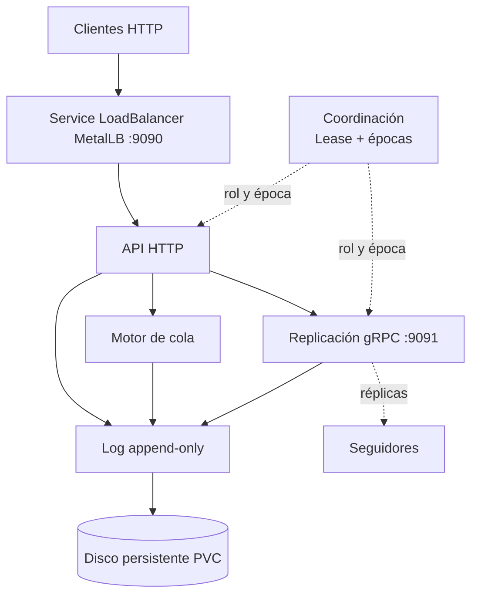

# K0sStreams

Broker de mensajes distribuido escrito en .NET. Corre como 3 pods en un cluster Kubernetes (k0s) y tolera la caída de uno sin perder mensajes confirmados.

Proyecto de la materia **Middlewares Distribuidos** (2026).

> **Estado:** en desarrollo. Está la base de la fase 0: solución, contratos, fakes en memoria, CI y Dockerfile. Cada bloque se desarrolla en su rama `feature/*` (ver [Plan de desarrollo](#plan-de-desarrollo)).

---

## ¿Qué hace?

Un productor publica mensajes en un **tópico**. Esos mensajes se pueden consumir de dos maneras, sobre los mismos datos:

| Modo | Parecido a | Cómo funciona |
| --- | --- | --- |
| **Historial** | Kafka | El consumidor lee desde el offset que quiera (`?from=150`) y puede releer todo las veces que necesite. |
| **Cola de trabajo** | Amazon SQS | Cada mensaje se entrega a un solo consumidor, que lo confirma (`ack`) o lo devuelve (`nack`). Hay reintentos con espera creciente, mensajes programados y una cola de mensajes muertos (DLQ). |

Por dentro, cada tópico es un **log append-only en disco** y se replica en los 3 brokers. Un mensaje se confirma al productor cuando está guardado en al menos 2 de los 3.

## Arquitectura en una mirada



Los tres brokers ejecutan la misma imagen. Uno es **líder** (el que tiene el Lease de Kubernetes) y recibe las escrituras; los otros dos son **seguidores** y guardan copias.

Las decisiones principales:

- **Clientes → broker:** HTTP REST con Swagger, puerto `9090`.
- **Broker ↔ broker:** gRPC, puerto `9091`.
- **Elección de líder:** Lease de Kubernetes (etcd garantiza que haya uno solo), más épocas y *fencing* propios para rechazar a un líder viejo.
- **Disco:** log append-only con *group commit* (un `fsync` por lote, no por mensaje).
- **Fuente de verdad única:** el log. Incluso el estado de la cola (receive, ack, nack, timeout) se guarda como eventos en el log, así un nuevo líder puede reconstruirlo.

### ¿Qué pasa si se cae el líder?

1. El líder deja de renovar el Lease.
2. El Lease vence (≈10 s) y otro broker lo toma.
3. El nuevo líder sube la **época** y descarta lo que no estaba confirmado por quórum.
4. Si el líder viejo vuelve, sus mensajes llevan una época vieja y se rechazan. Se reincorpora como seguidor.

El detalle completo (flujos, formato en disco, contratos) está en [docs/ARQUITECTURA.md](docs/ARQUITECTURA.md).

## API REST

Una vez levantado, la documentación interactiva queda en `http://<host>:9090/swagger`.

| Método | Ruta | Para qué |
| --- | --- | --- |
| `POST` | `/v1/topics` | Crear un tópico |
| `POST` | `/v1/topics/{t}/messages` | Publicar un mensaje |
| `GET` | `/v1/topics/{t}/partitions/{p}/messages?from=&max=` | Leer como historial |
| `POST` | `/v1/topics/{t}/queues/{q}/receive` | Tomar el próximo trabajo de la cola |
| `POST` | `/v1/topics/{t}/queues/{q}/ack/{offset}` | Confirmar que se procesó |
| `POST` | `/v1/topics/{t}/queues/{q}/nack/{offset}` | Devolverlo para reintentar |
| `GET` | `/v1/topics/{t}/queues/{q}/dlq` | Ver mensajes que agotaron los reintentos |
| `GET` | `/health`, `/ready` | Sondas de Kubernetes |

Ejemplo:

```bash
# Crear un tópico
curl -X POST http://localhost:9090/v1/topics \
  -H 'Content-Type: application/json' \
  -d '{"name":"pedidos","partitions":1,"maxRetries":3,"retryBackoff":"00:00:05"}'

# Publicar
curl -X POST http://localhost:9090/v1/topics/pedidos/messages \
  -H 'Content-Type: application/json' \
  -d '{"key":"pedido-1","value":"hola"}'

# Leer como historial desde el principio
curl 'http://localhost:9090/v1/topics/pedidos/partitions/0/messages?from=0&max=100'

# Consumir como cola
curl -X POST http://localhost:9090/v1/topics/pedidos/queues/facturacion/receive
curl -X POST http://localhost:9090/v1/topics/pedidos/queues/facturacion/ack/0
```

> Los cuerpos de ejemplo siguen el diseño acordado; pueden ajustarse cuando se implemente la API.

## Estructura del repositorio

```
K0sStreams/
├─ src/
│  ├─ K0sStreams.Contracts/     interfaces, DTOs y .proto compartidos
│  ├─ K0sStreams.Storage/       log en disco: segmentos, índice, CRC, group commit
│  ├─ K0sStreams.Queue/         motor de cola: estados, timeouts, reintentos, DLQ
│  ├─ K0sStreams.Replication/   gRPC entre brokers, quórum, puesta al día
│  ├─ K0sStreams.Coordination/  Lease, épocas, fencing, watcher del CRD Topic
│  └─ K0sStreams.Broker/        ejecutable: API HTTP y armado de todo (Program.cs)
├─ tests/                       un proyecto xUnit por cada proyecto de src/
├─ deploy/                      manifiestos de Kubernetes (StatefulSet, Service, RBAC, CRD)
├─ chaos/                       pruebas de caos y verificador de pérdida de mensajes
└─ docs/                        arquitectura, análisis y diagramas
```

Cada proyecto depende solo de `K0sStreams.Contracts`. Mientras una pieza no existe, las demás usan una versión falsa en memoria, por eso se puede trabajar en paralelo.

## Requisitos

| Herramienta | Versión | Obligatoria |
| --- | --- | --- |
| .NET SDK | 10 (LTS) | Sí |
| Docker | 27 o superior | Sí |
| kubectl | la del cluster | Sí |
| minikube o k0s de un nodo | última estable | Para probar en Kubernetes |
| curl, Postman o Bruno | cualquiera | Para probar la API |
| grpcurl | última estable | Desde la fase 2 |

## Cómo ejecutarlo

> Estos pasos aplican a medida que el código se incorpore al repositorio.

**Local, un solo broker:**

```bash
dotnet build
dotnet test
dotnet run --project src/K0sStreams.Broker
# Swagger en http://localhost:9090/swagger
```

**Kubernetes local (minikube):**

```bash
minikube start --driver=docker
kubectl get storageclass          # debe haber una clase por defecto para los PVC
kubectl apply -f deploy/
kubectl get pods -w               # esperar a broker-0, broker-1 y broker-2
```

**Crear un tópico con kubectl** (CRD, fase 5):

```bash
kubectl apply -f deploy/topic.yaml
```

## Plan de desarrollo

Se construye de abajo hacia arriba: primero el log, después la cola y la API, al final la parte distribuida. Cada fase termina con algo demostrable.

| Fase | Fechas | Qué se construye | Se considera terminada cuando… |
| --- | --- | --- | --- |
| 0. Cimientos | 22–27 sep | Repo, solución, CI, contratos, Dockerfile | `dotnet test` pasa en GitHub Actions |
| 1. Un broker completo (PoC) | 28 sep–7 oct | Log en disco, API básica, cola con ack y timeout, pod con PVC | Se publica, se mata el pod y se relee sin pérdida. **Entrega PoC: 07/10** |
| 2. Cola completa + gRPC | 8–14 oct | Reintentos, DLQ, programados; gRPC entre 2 procesos | Tests de cada estado de la cola; grpcurl replica un registro |
| 3. Replicación con quórum | 15–21 oct | Líder fijo replica a 2 seguidores, espera 2 de 3 | Con un seguidor apagado se sigue escribiendo |
| 4. Coordinación y failover | 22–28 oct | Lease, épocas, fencing, StatefulSet de 3 + MetalLB | Se mata al líder y otro toma el control en < 15 s sin perder mensajes confirmados |
| 5. Caos, CRD y pulido | 29 oct–4 nov | Suite de caos, CRD Topic, benchmark | "0 mensajes confirmados perdidos en N ejecuciones" |
| 6. Entrega | 5–11 nov | Informe, video, presentación | **Entrega final: 11/11** |

Si hay atraso se recorta, en este orden: CRD Topic, Server-Sent Events, varias particiones por tópico, mensajes programados. Nunca se recorta replicación con quórum, failover con épocas ni cola con ack y DLQ.

## Equipo y responsabilidades

| Rol | Se encarga de | Proyectos |
| --- | --- | --- |
| A — Almacenamiento | Log en disco, índice, CRC32, group commit, recuperación | `Storage` |
| B — Cola y API | Motor de cola y API HTTP + Swagger | `Queue`, `Broker` |
| C — Replicación | gRPC, quórum 2 de 3, high watermark, puesta al día de seguidores | `Replication` |
| D — Plataforma y coordinación | CI, Docker, Kubernetes, Lease, épocas, fencing, CRD, caos | `Coordination`, `deploy/`, `chaos/`, `.github/` |

## Cómo contribuir

1. Una rama por tarea y un PR revisado por otro integrante. `main` siempre compila.
2. Los tests se escriben antes que el código, sobre todo en `Storage` y `Queue`.
3. Cambiar `K0sStreams.Contracts` requiere acuerdo del equipo, porque afecta a todos.
4. La parte distribuida se diseña primero en papel o Miro y se revisa entre todos.
5. Si nadie del grupo puede explicar un código, no se mergea.

## Documentación

- [docs/ARQUITECTURA.md](docs/ARQUITECTURA.md): documento técnico completo (flujos, interfaces C#, formato en disco, servicio gRPC).
- [Documento técnico en línea](https://claude.ai/artifact/Wfp6im7Nn4MuKNvBEVtbDu): la misma arquitectura, con diagramas renderizados.
- [docs/K0sStreams_Analisis_y_Plan(1).docx.pdf](<docs/K0sStreams_Analisis_y_Plan(1).docx.pdf>): análisis inicial y estimación de horas.
