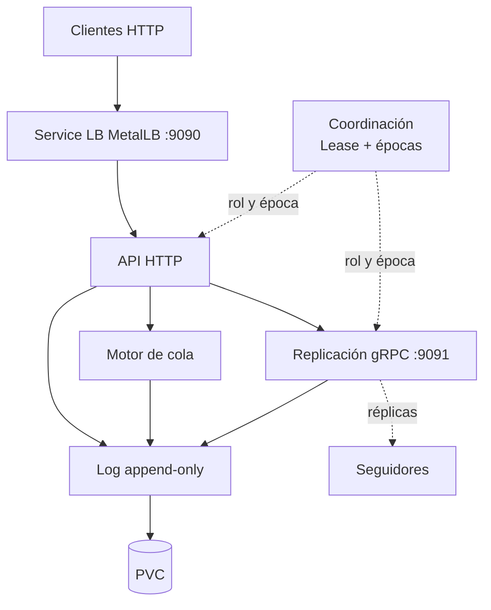
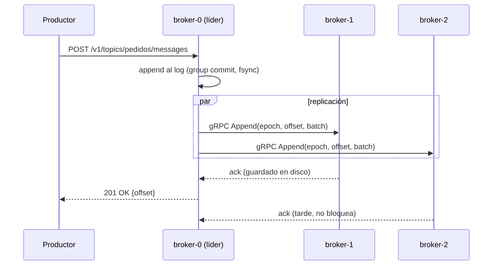
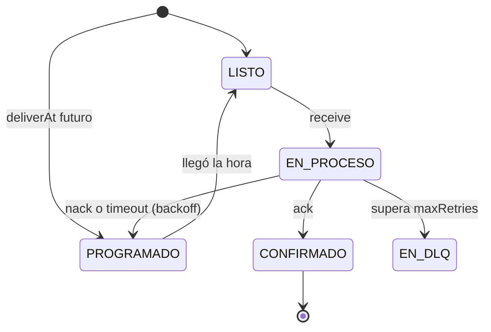

# K0sStreams: documento técnico de arquitectura y plan de desarrollo

Middlewares Distribuidos · 22 de septiembre de 2026

## Resumen

K0sStreams es un broker de mensajes en .NET que corre como 3 pods en k0s. Cada tópico se lee como historial (tipo Kafka) o como cola de trabajo (tipo SQS). Esta arquitectura fija cinco decisiones que ordenan todo el desarrollo:

| Decisión | Qué se usa | Qué reemplaza |
| --- | --- | --- |
| Acceso de clientes | HTTP REST + Swagger en el puerto 9090 | TCP binario propio |
| Comunicación entre brokers | gRPC en el puerto 9091 | Protocolo binario propio |
| Elección de líder | Lease de Kubernetes (etcd garantiza uno solo) + épocas y fencing propios | Algoritmo casero "ID más bajo" |
| Escritura en disco | Log append-only con group commit | fsync por mensaje |
| Semántica | Historial y cola sobre el mismo log; el estado de la cola también es un evento del log | Solo stream |

Consecuencia clave para el equipo: el log es la única fuente de verdad. La API, la cola y la replicación son capas que leen o escriben ese log. Eso permite trabajar en capas separadas con contratos fijos entre ellas.

## Componentes

Los tres brokers ejecutan el mismo binario y la misma imagen Docker. Solo cambia el rol: el que tiene el Lease es líder de la partición, los otros son seguidores. Cada broker tiene cinco capas internas, de arriba hacia abajo:

| Capa | Tecnología | Responsabilidad | En el líder | En un seguidor |
| --- | --- | --- | --- | --- |
| API HTTP :9090 | ASP.NET Core Minimal APIs + Swagger | Recibe peticiones de clientes, valida, traduce a llamadas al motor | Atiende escrituras y lecturas | Lecturas, o redirige (HTTP 307) escrituras al líder |
| gRPC interno :9091 | Grpc.AspNetCore + archivos .proto | Replicación y comandos entre brokers | Envía réplicas y espera 2 de 3 | Recibe réplicas y responde ack |
| Motor de cola | C# puro (máquina de estados) | ack, nack, visibility timeout, reintentos con backoff, DLQ, programados | Decide y escribe eventos de cola | Reconstruye el estado leyendo el log |
| Log append-only | C# + FileStream | Segmentos, índice disperso, CRC32, group commit, recuperación | Escribe mensajes y eventos | Escribe lo que replica el líder |
| PVC | StatefulSet volumeClaimTemplates | Disco persistente por pod | Igual | Igual |

Piezas fuera de los brokers:

| Componente | Qué es | Para qué sirve |
| --- | --- | --- |
| Clientes | curl, Postman o cualquier lenguaje | Productor (POST /messages), consumidor historial (GET ?from=) y consumidor cola (POST /receive y /ack) |
| Service LoadBalancer (MetalLB) | Service de Kubernetes con IP externa | Punto de entrada único en el puerto 9090; reparte entre los 3 pods |
| Lease de Kubernetes | Objeto coordination.k8s.io/v1 | Candado con vencimiento: quien lo renueva es el controlador/líder. etcd (Raft) garantiza que haya uno solo |
| Épocas y fencing | Contador en el log de cada broker | Cada cambio de líder sube la época; cualquier mensaje con época vieja se rechaza. Evita split-brain |
| CRD Topic | CustomResourceDefinition k0sstreams.io/v1 | Crear tópicos con kubectl apply -f topic.yaml; un watcher en el líder lo convierte en tópico |

Nota sobre el consenso: el proyecto no implementa consenso propio. Lo delega en el Lease (etcd). Lo propio del equipo son épocas, fencing, replicación y failover.

## Cómo se relacionan

Las dependencias van siempre hacia abajo: la API llama al motor de cola y al log; la replicación llama al log; nadie de abajo conoce a los de arriba. La coordinación (Lease + épocas) solo le dice a cada broker qué rol tiene.



Las líneas punteadas son señales de control, no llamadas de datos.

### Flujo 1: producir un mensaje



El líder responde apenas tiene 2 de 3 copias en disco (la suya + 1 seguidor). Si el POST cae en un seguidor, este redirige al líder.

### Flujo 2: leer como historial

1. GET /v1/topics/pedidos/partitions/0/messages?from=150&max=100.
2. El log busca el offset 150 en el índice disperso y lee secuencialmente.
3. Solo se devuelven mensajes hasta el high watermark: el último offset confirmado por quórum. Así nadie lee algo que podría perderse.

### Flujo 3: consumir como cola



Cada transición (receive, ack, nack, timeout) se escribe como un evento en el mismo log y se replica igual que un mensaje. Un seguidor que se vuelve líder reconstruye el estado de la cola leyendo esos eventos (event sourcing).

### Flujo 4: failover

1. broker-0 deja de renovar el Lease (se cayó o quedó aislado).
2. Vence el Lease (por ejemplo, 10 s) y broker-1 lo toma.
3. broker-1 sube la época (de N a N+1) y la escribe en su log.
4. broker-1 trunca lo que no estaba confirmado por quórum y empieza a aceptar escrituras.
5. Si broker-0 vuelve con época N, sus réplicas y escrituras se rechazan (fencing). Se pone al día como seguidor.

## Contratos entre componentes

Estos contratos se acuerdan en la semana 1 y se congelan. Cada integrante programa contra la interfaz, no contra el código del otro; mientras tanto usa un fake en memoria.

### Estructura de la solución

```
K0sStreams/
├─ src/
│  ├─ K0sStreams.Contracts/     interfaces, DTOs, .proto  (compartido, cambios por PR)
│  ├─ K0sStreams.Storage/       log: segmentos, índice, CRC, group commit
│  ├─ K0sStreams.Queue/         motor de cola: estados, timeouts, DLQ
│  ├─ K0sStreams.Replication/   gRPC, quórum, catch-up de seguidores
│  ├─ K0sStreams.Coordination/  Lease, épocas, fencing, watcher CRD
│  └─ K0sStreams.Broker/        host: API HTTP + wiring (Program.cs)
├─ tests/                       un proyecto xUnit por cada src/
├─ deploy/                      StatefulSet, Service, RBAC, CRD, topic.yaml
├─ chaos/                       scripts de caos + verificador
└─ docs/                        arquitectura, decisiones, diagramas
```

### Interfaces internas (C#)

La versión vigente está en `src/K0sStreams.Contracts/` (con comentarios XML). Resumen:

```csharp
public interface ILog {
    ValueTask<long> AppendAsync(string topic, int partition, Record record, CancellationToken ct = default);
    IAsyncEnumerable<Record> ReadAsync(string topic, int partition, long fromOffset, int max, CancellationToken ct = default);
    long HighWatermark(string topic, int partition);   // último offset confirmado por quórum (-1 si vacío)
    long EndOffset(string topic, int partition);       // último offset escrito localmente (-1 si vacío)
    void AdvanceHighWatermark(string topic, int partition, long offset);   // lo llama la replicación
    ValueTask TruncateAsync(string topic, int partition, long toOffset, CancellationToken ct = default);
}

public interface IQueueEngine {
    ValueTask<Delivery?> ReceiveAsync(string topic, string queue, TimeSpan visibility, CancellationToken ct = default);
    ValueTask<bool> AckAsync(string topic, string queue, int partition, long offset, CancellationToken ct = default);
    ValueTask<bool> NackAsync(string topic, string queue, int partition, long offset, string? reason, CancellationToken ct = default);
    IReadOnlyList<DeadLetter> GetDeadLetters(string topic, string queue);
    void Apply(string topic, Record queueEvent);   // reconstruye estado desde el log
}

public interface IReplicator {
    ValueTask WaitForQuorumAsync(string topic, int partition, long offset, CancellationToken ct = default);
}

public interface IClusterState {
    string NodeId { get; }
    bool IsLeader { get; }
    long CurrentEpoch { get; }
    string? LeaderAddress { get; }
    event Action<long>? EpochChanged;
}

public interface ITopicCatalog {
    ValueTask<bool> CreateAsync(TopicConfig config, CancellationToken ct = default);
    TopicConfig? Find(string name);
    IReadOnlyCollection<TopicConfig> List();
}
```

Cambios respecto de la primera versión de este documento (fase 0):

- `ILog.AdvanceHighWatermark`: la replicación sube el high watermark al lograr quórum.
- `AppendAsync` con `record.Offset = -1` asigna el offset (líder); con un offset explícito tiene que ser `EndOffset + 1` (réplica).
- `ReadAsync` no corta en el high watermark: la API corta, la réplica no.
- Ack y nack llevan la partición (con más de una partición el offset solo no alcanza) y devuelven `false` si el mensaje no estaba en proceso.
- `IQueueEngine.GetDeadLetters` para `GET /dlq`; `ITopicCatalog` para los tópicos; `IClusterState.NodeId`.
- Los eventos de cola se codifican con `QueueEvent`; la partición de un mensaje la elige `Partitioner` (CRC32 de la clave).

Fakes en memoria disponibles en `K0sStreams.Contracts.Fakes`: `InMemoryLog`, `InMemoryTopicCatalog`, `InstantReplicator`, `StaticClusterState`.

### Formato de registro en disco

| Campo | Tipo | Nota |
| --- | --- | --- |
| length | int32 | tamaño del resto del registro |
| crc32 | uint32 | sobre todo lo que sigue |
| offset | int64 | asignado por el líder |
| epoch | int64 | época del líder que lo escribió |
| type | byte | 0 = mensaje, 1 = receive, 2 = ack, 3 = nack, 4 = timeout, 5 = epoch-change |
| timestamp | int64 | ms Unix |
| deliverAt | int64 | 0 si es inmediato |
| key, value | bytes con longitud | payload del usuario o del evento |

Cada segmento es un par de archivos: 00000000000000000000.log y .index (offset → posición, uno cada 4 KB).

### API REST (puerto 9090)

| Método | Ruta | Uso |
| --- | --- | --- |
| POST | /v1/topics | Crear tópico {name, partitions, maxRetries, retryBackoff} |
| POST | /v1/topics/{t}/messages | Publicar {key, value, deliverAt?} → {partition, offset} |
| GET | /v1/topics/{t}/partitions/{p}/messages?from=&max= | Leer como historial |
| POST | /v1/topics/{t}/queues/{q}/receive | Tomar el próximo trabajo |
| POST | /v1/topics/{t}/queues/{q}/ack/{offset} | Confirmar |
| POST | /v1/topics/{t}/queues/{q}/nack/{offset} | Devolver con motivo |
| GET | /v1/topics/{t}/queues/{q}/dlq | Ver mensajes muertos |
| GET | /health, /ready, /swagger | Sondas de Kubernetes y documentación |

### Servicio gRPC (puerto 9091)

```protobuf
service Replication {
  rpc Append (AppendRequest) returns (AppendResponse);        // líder → seguidor
  rpc Fetch (FetchRequest) returns (stream RecordBatch);      // seguidor atrasado se pone al día
  rpc GetState (StateRequest) returns (StateResponse);        // época y end offset
}
message AppendRequest {
  int64 epoch = 1; string topic = 2; int32 partition = 3;
  int64 prev_offset = 4; int64 leader_hw = 5; repeated bytes records = 6;
  int64 prev_epoch = 7; string leader_id = 8;
}
message AppendResponse { bool ok = 1; int64 epoch = 2; int64 end_offset = 3; string error = 4; AppendError code = 5; }
```

Versión completa en `src/K0sStreams.Contracts/Protos/replication.proto`. Cada elemento de `records` es un registro codificado con `RecordCodec`, igual que en disco. `prev_epoch` permite que el seguidor detecte que su log divergió del líder (responde `LOG_MISMATCH`).

Regla de fencing en Append: si request.epoch < época local, el seguidor responde ok = false y su época. El líder viejo, al ver una época mayor, deja de ser líder.

## Qué instalar en esta primera instancia

Para la Prueba de Concepto alcanza con .NET, Docker y un Kubernetes local de un nodo. El cluster k0s de la cátedra (OpenStack, Cinder, MetalLB) recién hace falta en la fase 3.

### En la máquina de cada integrante

| Herramienta | Versión sugerida | Para qué | Obligatoria para la PoC |
| --- | --- | --- | --- |
| Git + cuenta GitHub | cualquiera reciente | Repo, PRs, GitHub Actions | Sí |
| .NET SDK | 10 (LTS) | Compilar y testear | Sí |
| IDE | VS Code + C# Dev Kit, o Rider | Programar y depurar | Sí |
| Docker Engine / Desktop | 27 o superior | Imagen del broker y docker compose de 3 nodos | Sí |
| kubectl | igual a la del cluster | Manejar el cluster | Sí |
| minikube, o k0s en modo single-node | última estable | Kubernetes local con PVC | Sí (al menos 1 integrante) |
| curl y Postman o Bruno | cualquiera | Probar la API REST | Sí |
| grpcurl | última estable | Probar el gRPC interno a mano | No, desde fase 2 |
| Claude Code | última | Generar código y tests con las reglas del CLAUDE.md | Recomendado |

### Paquetes NuGet

| Paquete | Proyecto que lo usa |
| --- | --- |
| Swashbuckle.AspNetCore | Broker (Swagger UI en /swagger) |
| Grpc.AspNetCore, Grpc.Tools, Google.Protobuf | Replication, Contracts |
| KubernetesClient | Coordination (Lease y CRD) |
| System.IO.Hashing | Storage (Crc32) |
| xunit, FluentAssertions, Microsoft.AspNetCore.Mvc.Testing | tests/ |

### Comandos de arranque

```bash
dotnet new sln -n K0sStreams
dotnet new classlib -o src/K0sStreams.Contracts
dotnet new classlib -o src/K0sStreams.Storage
dotnet new classlib -o src/K0sStreams.Queue
dotnet new classlib -o src/K0sStreams.Replication
dotnet new classlib -o src/K0sStreams.Coordination
dotnet new web      -o src/K0sStreams.Broker
dotnet sln add src/*/*.csproj

minikube start --driver=docker
kubectl get storageclass   # confirmar que hay una clase por defecto para los PVC
```

### En el cluster de la cátedra (fase 3)

- MetalLB con un pool de IPs, para el Service LoadBalancer.
- Una StorageClass (Cinder) para los PVC del StatefulSet.
- Permisos RBAC para que el ServiceAccount del broker pueda get/create/update sobre leases y leer topics.k0sstreams.io.

Pregunta abierta: todavía no se sabe si hay acceso al cluster de la cátedra; el plan asume minikube hasta confirmarlo.

## Pasos para desarrollar el proyecto

El orden va de abajo hacia arriba en el diagrama: primero el log, después la cola y la API, recién después la parte distribuida. Cada fase termina con algo demostrable.

| Fase | Fechas | Qué se construye | Criterio de terminado |
| --- | --- | --- | --- |
| 0. Cimientos | 22–27 sep | Repo, solución, CI (build + tests), CLAUDE.md, contratos congelados, Dockerfile | dotnet test en verde en GitHub Actions; interfaces y .proto mergeados |
| 1. Un broker completo (PoC) | 28 sep–7 oct | Log con segmentos, índice, CRC y recuperación; API de tópicos, publicar y leer; cola básica (receive, ack, visibility timeout); pod en minikube con PVC | Demo: publicar, matar el pod, volver a leer sin pérdida. Entrega PoC el 07/10 |
| 2. Cola completa + gRPC | 8–14 oct | Reintentos con backoff, DLQ, programados; servicio gRPC Append/Fetch/GetState entre 2 procesos locales | Tests de cada transición de estado; grpcurl replica un registro |
| 3. Replicación con quórum | 15–21 oct | Líder fijo (broker-0) replica a 2 seguidores, espera 2 de 3; high watermark; seguidor atrasado usa Fetch; eventos de cola replicados | docker compose de 3 nodos: se apaga un seguidor y se sigue escribiendo |
| 4. Coordinación y failover | 22–28 oct | Lease, épocas, fencing, truncado al cambiar de líder, redirección al líder; StatefulSet de 3 + MetalLB | Se mata al líder y otro toma el Lease en menos de 15 s, sin perder mensajes confirmados |
| 5. Caos, CRD y pulido | 29 oct–4 nov | Suite de caos + verificador; CRD Topic; benchmark simple | README con "0 mensajes confirmados perdidos en N ejecuciones" |
| 6. Entrega | 5–11 nov | Sin código nuevo: informe, video, presentación, ensayo | Entrega final el 11/11 |

Si hay atraso, se recorta en este orden: CRD Topic, Server-Sent Events, varias particiones por tópico, mensajes programados. Nunca se recorta replicación con quórum, failover con épocas ni cola con ack y DLQ.

### Reglas de trabajo

1. Una rama por tarea y PR con revisión de otro integrante; main siempre compila.
2. Los tests se escriben antes que el código, sobre todo en Storage y Queue.
3. Cambiar Contracts requiere acuerdo del equipo, porque rompe a todos.
4. La parte distribuida (fases 3 y 4) se dibuja primero en Miro o papel y se revisa entre todos.
5. Si nadie del grupo puede explicar un código generado, no se mergea.

## Distribución en 4 integrantes

Sí es viable, y 4 personas encajan mejor que 3: la arquitectura tiene 4 bloques con fronteras claras (almacenamiento, cola + API, replicación, plataforma + coordinación). Con las 226 h de equipo del análisis (≈ 260 con margen), la carga baja de unas 12 h a unas 9 h por persona por semana.

| Integrante | Dueño de | Proyectos del repo | Horas aprox. | Entrega para la PoC |
| --- | --- | --- | --- | --- |
| A — Almacenamiento | Log append-only: segmentos, índice, CRC32, group commit, recuperación y truncado | Storage | 55 | ILog real, con tests de corte a mitad de escritura |
| B — Cola y API | Motor de cola (ack, nack, timeout, reintentos, DLQ, programados) y API HTTP + Swagger | Queue, Broker | 60 | Endpoints de tópicos, publicar, leer, receive y ack |
| C — Replicación | Servicio gRPC, quórum 2 de 3, high watermark, catch-up de seguidores, replicar eventos de cola | Replication | 65 | .proto y un fake de IReplicator que confirma al instante |
| D — Plataforma y coordinación | CI, Docker, StatefulSet, PVC, MetalLB, RBAC, Lease, épocas, fencing, CRD, suite de caos | Coordination, deploy/, chaos/, .github/ | 70 | Pipeline de CI, imagen Docker y pod en minikube con PVC |

La documentación final (≈ 20 h) se reparte: cada uno escribe la sección de su bloque.

### Por qué no se mezclan las tareas

- Cada integrante es dueño de proyectos distintos del repo; dos personas casi nunca tocan el mismo archivo.
- Todos dependen solo de K0sStreams.Contracts, que se congela en la fase 0.
- Mientras un bloque no existe, se usa un fake: B programa la API contra un ILog en memoria; C prueba la replicación contra un ILog en memoria; B usa un IReplicator que confirma al instante; D usa un IClusterState fijo "soy líder, época 1".
- El único punto de integración es Program.cs del Broker, donde se cambian los fakes por las implementaciones reales.

### Quién hace qué en cada fase

| Fase | A — Almacenamiento | B — Cola y API | C — Replicación | D — Plataforma |
| --- | --- | --- | --- | --- |
| 0. Cimientos | ILog + formato de registro | IQueueEngine + rutas REST | .proto + IReplicator | Repo, CI, Dockerfile, CLAUDE.md |
| 1. PoC | Segmentos, índice, CRC, recuperación | API + cola básica sobre el fake, luego sobre el log real | Servidor gRPC vacío; ayuda a A con tests | Pod en minikube con PVC, health probes |
| 2. Cola + gRPC | Group commit, truncado | Reintentos, DLQ, programados | Append, Fetch, GetState entre 2 procesos | docker compose de 3 nodos; Lease básico |
| 3. Replicación | High watermark en ILog | Leer solo hasta high watermark; redirección al líder | Quórum y catch-up | StatefulSet de 3 + MetalLB |
| 4. Failover | Truncar al cambiar de época | Reconstruir cola al ser líder | Rechazo por época en Append | Lease, épocas, fencing |
| 5. Caos y CRD | Recuperación de archivos dañados | Verificador de mensajes | Pruebas de seguidor atrasado | Suite de caos, CRD Topic |

C y D son los bloques más difíciles (fases 3 y 4). Conviene que A y B, que terminan antes, pasen a revisar y probar esos bloques desde la fase 4. Así todos pueden explicar la parte distribuida en la defensa.

### Riesgos del reparto

- C tiene poco para integrar hasta la fase 2: compensa ayudando con los tests de A y armando el verificador temprano.
- D bloquea a todos si el CI o el Docker se atrasan: es lo primero de la semana 1.
- Si Contracts cambia seguido, el trabajo en paralelo se rompe: los cambios se agrupan y se discuten una vez por semana.
