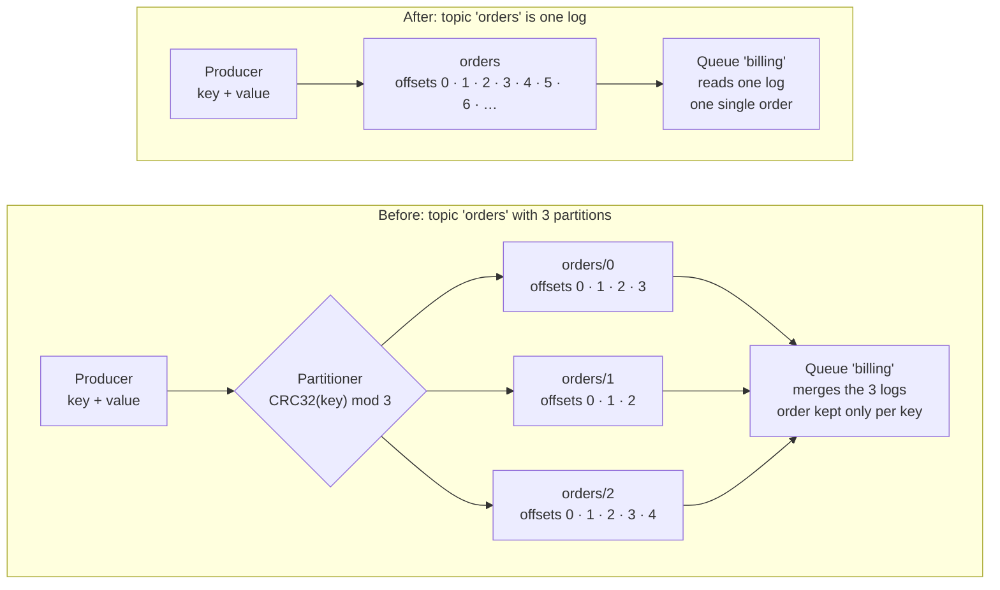

# Decision log

Decisions that change the scope, the contracts or the design of K0sStreams. Each entry says why it was taken, what it changes in each block, and what was left for later. Add new entries at the end, with the next number.

---

## DEC-001 · One partition per topic: remove partitions

| | |
| --- | --- |
| Date | 7 Oct 2026 |
| Proposed by | C, Replication |
| Status | Decided by C. Replication side done (8 Oct 2026). Changes to `Contracts` need the team's agreement (repo rule 3), in one grouped PR. |

### Context

Partitions split one topic into several independent logs, so it can be written and read in parallel. Systems like Kafka also spread them across brokers. Order is kept only within a partition, so messages with the same key always go to the same one.

In K0sStreams that benefit mostly doesn't apply. The one broker holding the Lease leads **every** partition, so partitions add no cross-broker scaling. They only add parallelism inside the leader. Meanwhile the concept runs through every contract, the REST routes, the queue events, the on-disk layout and the tests, and everyone has to reason about it. It was already third on the team's cut list.

This is an educational project. What it needs to demonstrate is quorum replication, epochs and fencing, failover and the log-that-is-also-a-queue, and none of that depends on partitions.

### Decision

**A topic is a single log.** Partitions are removed completely, not kept as a field fixed at 0: from the contracts, the gRPC protocol, the REST API, the queue events and the on-disk layout.

### With and without partitions

| | With partitions | Without |
| --- | --- | --- |
| A message is identified by | topic + partition + offset | topic + offset |
| Read as history | `GET /v1/topics/orders/partitions/1/messages?from=0` | `GET /v1/topics/orders/messages?from=0` |
| Ack | `POST .../queues/billing/ack/1/42` | `POST .../queues/billing/ack/42` |
| Order | Per partition (per key) | The whole topic |
| Who leads it | The Lease holder leads all three partitions | The Lease holder leads the one log |

The last row is the key point. In "before", the three partitions all live on the same leader, so splitting the topic doesn't spread any load across brokers.

### What changes

| Where | Change |
| --- | --- |
| `ILog` | Drop the `partition` parameter from all six methods. |
| `IReplicator` | `WaitForQuorumAsync(topic, offset)`. |
| `IQueueEngine` | `AckAsync` and `NackAsync` drop `partition`; `Delivery` and `DeadLetter` drop `Partition`. |
| `QueueEvent` | Drop `Partition`. The event value becomes `targetOffset int64 \| untilMs int64 \| reason`. This changes the on-disk format, which is safe now because nothing has been stored yet. |
| `TopicConfig` | Drop `Partitions` and `MaxPartitions`. |
| `Partitioner` | Delete it, along with `PartitionerTests`. |
| `Api/Dtos.cs` | `CreateTopicRequest` and `TopicResponse` drop `Partitions`; `PublishResponse`, `DeliveryResponse` and `DeadLetterResponse` drop `Partition`. |
| `replication.proto` | Remove `partition` from `AppendRequest`, `FetchRequest` and `StateRequest`, and mark those field numbers `reserved`. |
| Fakes | `InMemoryLog` keyed by topic only; `InstantReplicator` follows `IReplicator`. |
| **A**, Storage | One folder per topic, with no partition level. |
| **B**, Queue and API | Read becomes `GET /v1/topics/{t}/messages?from=&max=`. Ack and nack become `/v1/topics/{t}/queues/{q}/ack/{offset}` and `.../nack/{offset}`; the `fix/ack-nack-partition-en-ruta` branch is no longer needed. Consuming no longer merges partitions. |
| **C**, Replication | ✅ Done. Validation and locks are per topic. `SingleLog.cs` pins partition 0 and rejects any other until the contracts change; then that file is deleted. |
| **D**, Platform | The `Topic` CRD has no `partitions` field. |
| Docs | README, ARQUITECTURA.md, contexto.md and the replication docs drop partitions from routes, examples and diagrams. |

### Consequences

**Gains**

- Simpler contracts, API, queue engine and tests, with one less concept to explain in the defense.
- **A stronger ordering guarantee:** every consumer sees all of a topic's messages in one single order, not just per key.

**Losses**

- A topic's throughput is capped by one log (one write path and one group commit on the leader).
- No parallelism within a topic. Anyone who needs it can use several topics (`orders-1`, `orders-2`…) and route between them on the client side.

### Alternatives considered

- **Keep `partition` everywhere, fixed at 0.** No contract churn, but the concept stays in every signature, route and test, and has to be explained anyway. Rejected: the point is to simplify.
- **Keep partitions as designed.** Rejected: the complexity is real and the benefit doesn't apply while one broker leads everything.

### Future improvement

Partitions come back only if the project needs to scale beyond one log per topic. Done properly, that would mean:

1. Bring back `partition` in `ILog`, `IReplicator`, `IQueueEngine`, the proto (with new field numbers) and the REST routes, plus a key-based partitioner.
2. **A leader per partition** (one Lease each), spread across the brokers. Without this, partitions add complexity but no real scaling.
3. Consumers that read a topic across its partitions, with order kept only per key.

Worth mentioning in the defense as the way the design would scale.

### Next steps

1. Agree on this with the team and merge one PR to `Contracts` with all the contract changes above.
2. Each block adapts in its own branch. For replication it's a small change, done right after the Contracts PR.
3. Update the docs listed above.
