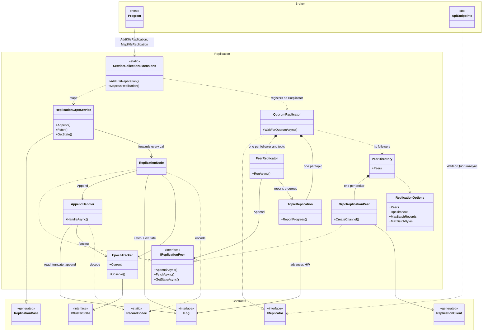
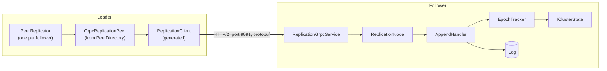

# Replication: code guide

How the code in `src/K0sStreams.Replication` is put together: which classes exist, what each one is for, why it matters, and where the block meets the rest of the system. It stays at the level of responsibilities. For the details, read the code; for the reasoning behind the protocol, read [replication.md](replication.md).

Reflects the code as of [iteration 2](replication-iterations.md) (phase 3): follower side, gRPC layer and leader side. Section 8 shows what's still to come.

---

## 1. The block in one minute

Replication is the only part of a broker that talks to **other brokers**. Everything it does fits in two directions:

- **Inbound.** Another broker calls this one over gRPC, on port 9091: "append these records", "send me your records from offset N", "what's your state?". The request goes through a thin gRPC adapter into plain C# classes, which check it and touch the local log.
- **Outbound.** This broker calls another one. A small client wraps the generated gRPC client, and a directory keeps one connection per configured broker. The leader's `QuorumReplicator` runs one loop per follower that pushes records through it.

Both directions share one interface, `IReplicationPeer`: "the operations you can ask of a broker". Locally it's implemented by the class that does the work; remotely, by the gRPC client. That symmetry is what lets the tests run a three-broker cluster inside a single process.

---

## 2. Structure

### 2.1 Class diagram

Each box is a project. A plain solid arrow means "holds a reference and calls"; a plain dashed arrow means "uses" or "creates". A hollow triangle means "implements" when the line is dashed and "inherits from" when it is solid. A diamond means "owns".

How to read the boundaries:

- **Broker → Replication.** The host only knows two methods, `AddK0sReplication` and `MapK0sReplication`. Everything else in the block is `internal`.
- **Replication → Contracts.** The block depends only on shared contracts: `ILog` (implemented by A), `IClusterState` (implemented by D), the record format `RecordCodec`, and the classes generated from `replication.proto`.
- **Replication → B.** B never calls replication classes directly. It calls `IReplicator`, implemented by `QuorumReplicator`.
- **What isn't drawn:** A's and D's real classes. Today `ILog` is the `InMemoryLog` fake and `IClusterState` is the `StaticClusterState` fake. Replication code never names either of them, so swapping them for the real ones changes nothing here.

### 2.2 A call between two brokers

The class diagram shows structure. This shows what happens at runtime when one broker calls another, here an `Append` from the leader to a follower:

The tests skip the network by calling the follower's `ReplicationNode` directly. Since both it and `GrpcReplicationPeer` implement `IReplicationPeer`, the caller can't tell which one it has.

---

## 3. Inbound: answering other brokers

### 3.1 `ReplicationGrpcService`

[ReplicationGrpcService.cs](../src/K0sStreams.Replication/ReplicationGrpcService.cs) · runs on every broker · one instance per call (gRPC default)

**What it does.** It's the gRPC endpoint. It inherits from the generated `Replication.ReplicationBase` and overrides `Append`, `Fetch` and `GetState`, forwarding each to `ReplicationNode`. For `Fetch`, it writes each batch to the response stream as `ReplicationNode` produces it.

**Why it matters.** It's the only server-side class that knows about gRPC. Because it has no logic, all the protocol behaviour sits in classes that can be tested without starting a server. If something goes wrong in the wire format, ports or HTTP/2, this class and its registration are where to look.

### 3.2 `ReplicationNode`

[ReplicationNode.cs](../src/K0sStreams.Replication/ReplicationNode.cs) · runs on every broker · singleton

**What it does.** It's this broker's implementation of `IReplicationPeer`, the protocol as plain C#:

- **`Append`**: hands the request to `AppendHandler`.
- **`Fetch`**: reads from the log starting at the requested offset, up to `max_records` or the end of the log. It ignores the high watermark, because followers need unconfirmed records too. Records are re-encoded with `RecordCodec` and grouped into batches of at most `MaxBatchRecords` records and roughly `MaxBatchBytes` bytes. Each batch carries this broker's current high watermark.
- **`GetState`**: returns epoch, end offset, high watermark, node id and leader flag for one topic.

Invalid requests (bad topic name, out-of-range partition, negative offset) fail with an `RpcException` carrying `InvalidArgument`, the same error a remote broker returns.

**Why it matters.** It's the single implementation of "what a broker answers". gRPC calls and in-process tests go through exactly this code, so the tests check what really runs in production.

### 3.3 `AppendHandler`

[AppendHandler.cs](../src/K0sStreams.Replication/AppendHandler.cs) · runs on followers · singleton

**What it does.** Decides whether a follower's log changes when a leader sends records, and how. For each request, in this order:

1. **Validate the address.** An invalid topic name or partition → `UNKNOWN_TOPIC`.
2. **Fence.** A request from an older epoch than this broker's → `STALE_EPOCH`. A newer epoch is adopted at once.
3. **Check continuity.** The follower must already have the record just before the batch, with the same epoch → otherwise `LOG_MISMATCH`, with its end offset as a hint.
4. **Check the batch.** Every record must decode with a valid CRC, offsets must have no gaps, and epochs must be plausible → otherwise `CORRUPT_RECORD`, and nothing is written.
5. **Reconcile.** Records the follower already has are skipped. At the first record that conflicts, the follower's tail is truncated, since it came from an old leader.
6. **Append** the rest.
7. **Move the high watermark** up to whatever the leader says is confirmed, but never past what this request just verified.

Requests for the same topic run one at a time (a lock per topic). A conflict with a record the follower already counted as confirmed is never truncated: it's logged as critical and the call fails.

**Why it matters.** It's the heart of the block, and the only class that changes a follower's disk. A bug here can lose or corrupt confirmed messages, which is the one thing the project promises never to do. That's why it has the largest test class, and why the reasoning behind each step is written down in [replication.md §5.3](replication.md#53-what-a-follower-does-with-an-append).

**What it doesn't do (yet).** It doesn't check whether the topic exists in `ITopicCatalog` ([§10.3](replication.md#103--topics-on-followers-a-b-c-open-topic-1-in-contextomd)). It doesn't refuse appends when it is itself the leader (phase 4). It writes records one by one ([§10.4](replication.md#104--expectations-on-ilog-a)).

---

## 4. Outbound: calling other brokers

### 4.1 `IReplicationPeer`

[IReplicationPeer.cs](../src/K0sStreams.Replication/IReplicationPeer.cs)

**What it is.** "A broker you can talk to": `AppendAsync`, `FetchAsync` and `GetStateAsync`. Requests and responses are the classes generated from `replication.proto`; there are no duplicate C# types.

**Why it matters.** It's the seam that makes the block testable. Production code talks to other brokers through `GrpcReplicationPeer`. Tests hand the leader `ReplicationNode`s instead, wrapped in `FaultyPeer` to simulate a slow or broken network. Both implementations fail invalid requests the same way, so callers never need to know which one they have.

### 4.2 `GrpcReplicationPeer`

[GrpcReplicationPeer.cs](../src/K0sStreams.Replication/GrpcReplicationPeer.cs) · used by the leader

**What it does.** It implements `IReplicationPeer` on top of the generated `ReplicationClient`:

- `Append` and `GetState` get a deadline of `RpcTimeout` (2 s by default), measured with `TimeProvider` so tests can control time.
- `Fetch` has no deadline, because a long catch-up can take a while; it ends with the caller's cancellation token.
- `CreateChannel` builds the HTTP/2 connection with message limits of 32 MiB. The gRPC default of 4 MB would reject a single large record (records can be up to 16 MiB).

Failures surface as `RpcException`: `Unavailable` when the broker can't be reached, `DeadlineExceeded` when it's too slow.

**Why it matters.** It's the only client-side class that knows about the network. Its deadlines are how a leader notices that a follower is gone, and its message limits decide what can be replicated at all.

### 4.3 `PeerDirectory`

[PeerDirectory.cs](../src/K0sStreams.Replication/PeerDirectory.cs) · singleton

**What it does.** Reads `Replication:Peers` (node id → gRPC address), skips this broker's own entry, and builds one `GrpcReplicationPeer` per remaining broker. Channels are created once, connect lazily on the first call, and are closed when the broker shuts down.

**Why it matters.** It turns configuration into "the other brokers". `QuorumReplicator` gets its followers from it. Keeping peer addresses in replication's own configuration means no contract change was needed ([§10.2](replication.md#102--who-are-my-peers-c-d)).

### 4.4 `QuorumReplicator`

[QuorumReplicator.cs](../src/K0sStreams.Replication/QuorumReplicator.cs) · runs on the leader · singleton, registered as `IReplicator`

**What it does.** It's the `IReplicator` B calls after each append. `WaitForQuorumAsync` checks that this broker leads, finds or starts the topic's replication, and completes once the high watermark covers the offset.
- **Leadership comes in terms.** A `LeaderTerm` lasts while `IClusterState` says this broker leads at one epoch and no broker has shown a newer one.
- **Stepping down ends the term as a whole.** On `EpochChanged`, on a follower's `STALE_EPOCH`, or at shutdown, every pending wait fails with `NotLeaderException` and every loop stops.
- **No peers configured (a single broker)?** A write is confirmed by this broker alone, with a warning in the log.

**Why it matters.** It decides when a producer gets its `201`. A broker that has been replaced must never confirm anything, and this is where that's enforced on the leader side.

### 4.5 `PeerReplicator`

[PeerReplicator.cs](../src/K0sStreams.Replication/PeerReplicator.cs) · runs on the leader · one per follower and topic

**What it does.** A background loop that keeps one follower up to date for one topic:
- **Sending.** It reads the records the follower is missing from the leader's log and sends them with `Append`, one request at a time.
- **Answers.** It counts what the request verified as the follower's progress. On `LOG_MISMATCH` it steps back and retries. On `STALE_EPOCH` it adopts the newer epoch and steps the leader down.
- **Idle and failing.** When idle, it sends a heartbeat every `HeartbeatInterval`. When the follower fails, it retries after a backoff that doubles up to `MaxRetryBackoff`.

**Why it matters.** It's what actually moves data between brokers, and the reason a slow or dead follower never holds up the others: each loop has its own request in flight.

### 4.6 `TopicReplication`

[TopicReplication.cs](../src/K0sStreams.Replication/TopicReplication.cs) · runs on the leader · one per topic and term

**What it does.** For one topic it holds how far each follower is verified to match the leader, the high watermark, and the writes waiting to be confirmed, all under one lock. When enough followers have a record **from the current epoch**, it advances the HW in `ILog` and completes the waits it covers.

**Why it matters.** It's the single place where "confirmed" is decided, including Raft's rule that only a current-epoch record is confirmed by counting copies.

### 4.7 `LeaderTerm` and `AsyncSignal`

[LeaderTerm.cs](../src/K0sStreams.Replication/LeaderTerm.cs) and [AsyncSignal.cs](../src/K0sStreams.Replication/AsyncSignal.cs)

**What they do.**
- **`LeaderTerm`** is one period of leadership: its epoch, its topics, its loops, and the cancellation that stops them together.
- **`AsyncSignal`** wakes a loop when there's something to send: a new write, a new HW, a heartbeat that's due, or the term stopping.

**Why they matter.** Stopping leadership as one unit is what keeps an old term from confirming writes after a newer one has started.

---

## 5. Shared state, configuration and helpers

### 5.1 `EpochTracker`

[EpochTracker.cs](../src/K0sStreams.Replication/EpochTracker.cs) · singleton

**What it does.** Holds this broker's epoch for fencing: the higher of the epoch reported by `IClusterState` (D) and the highest epoch accepted from a leader. `Observe` raises it, safely under concurrent calls; it never goes down.

**Why it matters.** Fencing is what stops a replaced leader from writing, and it depends on this number. Both sources count because a new leader can start sending records before this broker's coordination has noticed the Lease changed hands.

### 5.2 `ReplicationOptions`

[ReplicationOptions.cs](../src/K0sStreams.Replication/ReplicationOptions.cs) · bound from the `Replication` configuration section

**What it does.** Holds every setting of the block: `Peers`, `RpcTimeout`, `MaxBatchRecords`, `MaxBatchBytes`, plus the fixed gRPC message limit (`MaxMessageSize`). The values are checked when the broker starts.

**Why it matters.** It's the block's only configuration surface. Checking at startup means a typo in a deployment stops the broker immediately, with a clear message, instead of silently breaking replication later.

### 5.3 `SingleLog`

[SingleLog.cs](../src/K0sStreams.Replication/SingleLog.cs)

**What it does.** Every topic is a single log ([DEC-001](decisions.md)), but `ILog` and `replication.proto` still have a partition until the contracts change. This class pins it to 0 in one place:

- `IsValid(topic, partition)`: a valid topic name (the same rules as topic creation) and no partition other than 0.
- `ILog` overloads without the partition (`log.EndOffset(topic)`, `log.AppendAsync(topic, record)`…). The rest of the block uses them, so it already reads as it will after the contracts change.

**Why it matters.** Topic names become folder names on disk, and gRPC requests come from the network. Every operation calls `IsValid` before touching the log, so a request for a topic like `../etc` never reaches A's storage code. When the Contracts PR for DEC-001 lands, this file is deleted and nothing else in the block changes.

---

## 6. Wiring: `ServiceCollectionExtensions`

[ServiceCollectionExtensions.cs](../src/K0sStreams.Replication/ServiceCollectionExtensions.cs)

**What it does.** These are the only two methods the host calls (from `Program.cs`, which no block edits).

`AddK0sReplication` registers:

| Service | Lifetime | Note |
| --- | --- | --- |
| `ReplicationOptions` | options | Bound from `Replication`, checked at startup. |
| `TimeProvider` | singleton | Only if the host didn't register one already. |
| `EpochTracker`, `AppendHandler`, `ReplicationNode`, `PeerDirectory` | singleton | One per broker. |
| gRPC | — | Message limits raised to `MaxMessageSize`. |
| `IReplicator` → `QuorumReplicator` | singleton | Built by a factory that passes `PeerDirectory.Peers`. Created after `PeerDirectory`, so at shutdown its loops stop before the channels close. |

`MapK0sReplication` maps `ReplicationGrpcService`. The service ends up reachable only on port 9091, because that's the only port configured for HTTP/2 (`appsettings.json`).

**Why it matters.** It's the whole contract between the replication block and the host. Plugging the real replicator in, or changing how the block is built, never touches `Program.cs`.

---

## 7. Boundaries with the rest of the system

What replication expects from each neighbour, in code terms. The full list of expectations and open questions is in [replication.md §10](replication.md#10-open-issues-to-agree-with-the-team).

| Neighbour | Through | Replication relies on |
| --- | --- | --- |
| **A, Storage** | `ILog` | Appends with an explicit offset must be exactly the next one. Reads don't stop at the high watermark. The high watermark only goes up. Truncating below it throws. `EndOffset` and `ReadAsync` work on partitions never written. |
| **D, Coordination** | `IClusterState` | `NodeId` (used to skip itself in `PeerDirectory`), `CurrentEpoch` (fencing), `IsLeader` (reported by `GetState`). |
| **B, Queue and API** | `IReplicator` | B calls `WaitForQuorumAsync` after each append, with a timeout, and maps `NotLeaderException` to 307/503. Records are stamped with the current epoch. |
| **Shared format** | `RecordCodec`, `replication.proto` | Records travel as the same bytes they have on disk. Replication never inspects record types, so queue events replicate like any message. |
| **Other brokers** | gRPC on port 9091 | Cleartext HTTP/2. Every broker runs the same image, but a rolling update briefly mixes versions, so changes to `replication.proto` must stay backward compatible (add fields, never renumber). |

---

## 8. What comes next, and where it plugs in

| Phase | New class | Plugs into |
| --- | --- | --- |
| 3 ✅ | `QuorumReplicator`, `TopicReplication`, `PeerReplicator` | Built in iteration 2 (sections 4.4 to 4.7). |
| 3 ✅ | `FaultyPeer` (tests) | Wraps an `IReplicationPeer` to pause, disconnect or lose responses. |
| 4 | `LeaderPromotion` | Called by D when it wins the Lease, before the broker announces itself as leader ([§10.1](replication.md#101--failover-as-currently-described-can-lose-confirmed-messages-c-d-a)). Uses `GetStateAsync` and `FetchAsync` on the peers. |

Neither phase changes the classes in section 3; the leader side sits on top of them.

---

## 9. Tests

Everything is in `tests/K0sStreams.Replication.Tests/`, and the internal classes are visible to it (`InternalsVisibleTo`).

**Helpers** (`Support/`):

| Helper | What it gives you |
| --- | --- |
| `TestNode` | One broker's replication stack (`InMemoryLog`, `EpochTracker`, `AppendHandler`, `ReplicationNode`), called directly with no network. |
| `ControllableClusterState` | An `IClusterState` whose leader and epoch the test can change; `StaticClusterState` can't. |
| `ReplicationTestServer` | The replication block served by Kestrel over real HTTP/2 on a free port, registered exactly like in the real host, plus a gRPC client to it. |
| `TestRecords` | Builders for records, sequences of records with given epochs, and `Append` requests. |
| `FaultyPeer` | The link from the leader to one follower: disconnect it, pause its calls, lose the next response, or swap the follower behind it (a restart). |
| `ReplicationCluster` | A leader and two followers in one process, wired through `FaultyPeer`s, on a `FakeTimeProvider`. |
| `Eventually` | Waits for background loops. With fake time, each poll advances the clock a little, so backoffs and heartbeats happen without real waiting. |

**Test classes:**

| Class | Exercises |
| --- | --- |
| `AppendHandlerTests` | `AppendHandler`, through `ReplicationNode` |
| `ReplicationNodeTests` | `Fetch` and `GetState` |
| `GrpcReplicationTests` | `ReplicationGrpcService` and `GrpcReplicationPeer` together, broker to broker |
| `QuorumReplicatorTests` | The leader side: quorum, followers down or slow, catch-up, divergence, epoch rule, stepping down, disposal |
| `GrpcQuorumTests` | Three brokers over real gRPC: a follower stops, writes continue, it restarts and catches up |
| `EpochTrackerTests` | `EpochTracker` |
| `RegistrationTests` | `ServiceCollectionExtensions`, `ReplicationOptions`, `PeerDirectory`, the registered `IReplicator` |

---

## 10. Where to start reading

1. [IReplicationPeer.cs](../src/K0sStreams.Replication/IReplicationPeer.cs): the three operations, in a dozen lines.
2. [AppendHandler.cs](../src/K0sStreams.Replication/AppendHandler.cs), next to [replication.md §5.3](replication.md#53-what-a-follower-does-with-an-append): the core logic and the reasoning behind it.
3. [AppendHandlerTests.cs](../tests/K0sStreams.Replication.Tests/AppendHandlerTests.cs): each test name is one rule, so this reads like a spec.
4. [ReplicationNode.cs](../src/K0sStreams.Replication/ReplicationNode.cs), then [ReplicationGrpcService.cs](../src/K0sStreams.Replication/ReplicationGrpcService.cs) and [GrpcReplicationPeer.cs](../src/K0sStreams.Replication/GrpcReplicationPeer.cs): how the core is exposed and reached over the network.
5. [QuorumReplicator.cs](../src/K0sStreams.Replication/QuorumReplicator.cs), [TopicReplication.cs](../src/K0sStreams.Replication/TopicReplication.cs) and [PeerReplicator.cs](../src/K0sStreams.Replication/PeerReplicator.cs), next to [QuorumReplicatorTests.cs](../tests/K0sStreams.Replication.Tests/QuorumReplicatorTests.cs): the leader side.
6. [ServiceCollectionExtensions.cs](../src/K0sStreams.Replication/ServiceCollectionExtensions.cs): how it all gets wired into the broker.

A few conventions you'll see throughout: everything is `internal` except the options and the registration methods; every `await` in library code uses `ConfigureAwait(false)`; logging uses source-generated `[LoggerMessage]` methods; time goes through `TimeProvider`, never `DateTime.UtcNow`.
