# Replication: scenarios and guardrails

How replication behaves when everything works (part 1), what can go wrong, and what the code does about each case (part 2). Every scenario has a diagram, the guardrail that handles it, where that guardrail lives in the code, and the test that proves it.

Reflects the code as of [iteration 1](replication-iterations.md) (phase 2): the follower side and the gRPC layer. What the *leader* does with each answer arrives in phase 3; where it matters it's drawn in grey and marked "Phase 3". For the reasoning behind the protocol see [replication.md](replication.md); for the classes, see the [code guide](replication-code-guide.md).

**How to read the diagrams**

- `42/e2` means "the record at offset 42, written in epoch 2".
- Colours in flowcharts: green = accepted or written, red = rejected with nothing written, amber = allowed but worth noticing (truncation, an early stop), grey dashed = not built yet.
- In sequence diagrams, a shaded block is phase-3 behaviour.

---

## Contents

| # | Scenario | Guardrail | Result | Proven by |
| --- | --- | --- | --- | --- |
| | **Part 1 · Normal flow** | | | |
| [N1](#n1-the-whole-write-path-and-which-parts-exist-today) | The whole write path | — | Which pieces exist today | — |
| [N2](#n2-a-normal-append-step-by-step-through-the-code) | A normal append, step by step | Every gate passes | Records appended, HW follows the leader | `Append_after_the_last_record_extends_the_log_and_follows_the_leaders_high_watermark`, `Records_fetched_from_one_broker_are_replicated_to_another` |
| [N3](#n3-steady-state-batches-and-heartbeats) | Steady state: batches and heartbeats | — | Follower HW one round behind, then catches up | `Heartbeat_moves_the_high_watermark_up_to_the_leaders` |
| [N4](#n4-reading-a-brokers-state-and-records) | Reading a broker's state and records | — | State, and batches with the HW | `GetState_reports_epoch_offsets_and_role`, `Fetch_streams_the_log_in_batches_of_at_most_MaxBatchRecords` |
| | **Part 2 · Failure scenarios** | | | |
| [0](#0-the-map-every-check-an-append-goes-through) | Overview | The checks in order | — | — |
| [1](#1-a-request-names-an-invalid-topic-or-partition) | Invalid topic or partition (e.g. `../etc`) | Validate the address before touching the log | `UNKNOWN_TOPIC` / `InvalidArgument` | `Invalid_topic_or_a_partition_other_than_0_is_rejected`, `Invalid_fetch_fails_with_invalid_argument`, `Invalid_GetState_fails_with_invalid_argument`, `Invalid_requests_fail_with_invalid_argument` |
| [2](#2-a-replaced-leader-keeps-writing) | A replaced leader keeps writing | Fencing by epoch | `STALE_EPOCH` | `Append_with_an_older_epoch_is_rejected_and_reports_the_local_epoch`, `A_stale_leader_is_fenced` |
| [3](#3-the-new-leader-is-faster-than-coordination) | New leader is faster than coordination | Adopt the newer epoch at once | Older leaders fenced from then on | `A_newer_epoch_is_adopted_and_fences_older_leaders`, `A_newer_epoch_is_adopted_even_when_the_log_does_not_match`, `EpochTrackerTests` |
| [4](#4-the-follower-is-behind) | Follower is behind (was down) | Refuse to leave a hole | `LOG_MISMATCH` + end offset | `Missing_previous_record_is_a_mismatch_that_reports_the_end_offset` |
| [5](#5-the-followers-history-differs-just-before-the-batch) | History differs just before the batch | Compare the previous record's epoch | `LOG_MISMATCH` | `Previous_record_with_another_epoch_is_a_mismatch` |
| [6](#6-damaged-bytes) | Damaged bytes | Decode and CRC-check the whole batch before writing | `CORRUPT_RECORD`, nothing written | `Record_with_a_bad_crc_is_rejected_and_nothing_is_appended`, `Incomplete_or_padded_record_bytes_are_rejected` |
| [7](#7-a-batch-that-cannot-be-right) | A batch that can't be right | Offsets in sequence, sane epochs | `CORRUPT_RECORD` | `Records_with_a_gap_in_their_offsets_are_rejected`, `Records_with_an_impossible_epoch_are_rejected` |
| [8](#8-a-very-large-record) | A very large record | Raised gRPC message limits | Replicates | `A_record_larger_than_the_default_grpc_limit_replicates` |
| [9](#9-the-leader-retries-an-append-that-already-succeeded) | Leader retries an append that already worked | Same offset + epoch = same record | Nothing duplicated | `Repeating_an_append_changes_nothing` |
| [10](#10-an-old-shorter-request-arrives-late) | An old, shorter request arrives late | Truncate only on a real conflict | Tail kept | `A_shorter_matching_append_does_not_truncate_the_tail` |
| [11](#11-the-follower-holds-records-from-an-old-leader) | Follower holds records from an old leader | Truncate at the first conflict | Tail replaced | `Divergent_tail_is_replaced_by_the_leaders_records`, `Records_before_the_first_conflict_are_kept` |
| [12](#12-the-leader-contradicts-confirmed-data) | Leader contradicts confirmed data | Never truncate below the HW | Refused, critical log | `Conflict_with_confirmed_records_is_refused` |
| [13](#13-deciding-what-the-follower-counts-as-confirmed) | What a follower counts as confirmed | HW = min(leader's HW, verified prefix), never backwards | Unverified records never confirmed | `Heartbeat_moves_the_high_watermark_up_to_the_leaders`, `High_watermark_stops_at_the_prefix_verified_against_the_leader`, `High_watermark_never_moves_back` |
| [14](#14-two-requests-for-the-same-topic-at-once) | Two requests for one topic at once | Lock per topic | Run one after the other | `Concurrent_appends_to_the_same_topic_do_not_interfere` |
| [15](#15-a-broker-asks-for-records-fetch) | A broker asks for records (`Fetch`) | Validated, bounded batches | Batches with the HW | `Fetch_*` tests in `ReplicationNodeTests` |
| [16](#16-the-other-broker-is-down-or-slow) | The other broker is down or slow | Deadlines on calls | `Unavailable` / `DeadlineExceeded` | `An_unreachable_broker_fails_with_unavailable` (slow path not tested yet) |
| [17](#17-the-configuration-is-wrong) | Wrong configuration | Checked at startup; never a peer of itself | Broker refuses to start | `Out_of_range_settings_are_rejected`, `Peers_come_from_configuration_and_exclude_this_broker` |
| [18](#18-not-guarded-yet) | What isn't guarded yet | — | — | — |

---

## Part 1 · Normal flow

What happens when nothing goes wrong. Every gate in the [map](#0-the-map-every-check-an-append-goes-through) answers "yes", and records move from the leader to the followers.

### N1. The whole write path, and which parts exist today

From a producer's request to its `201`. Colours here mean something different from the rest of the doc: green = built (replication, iteration 1); amber = a fake standing in for the real piece; grey dashed = not built yet.

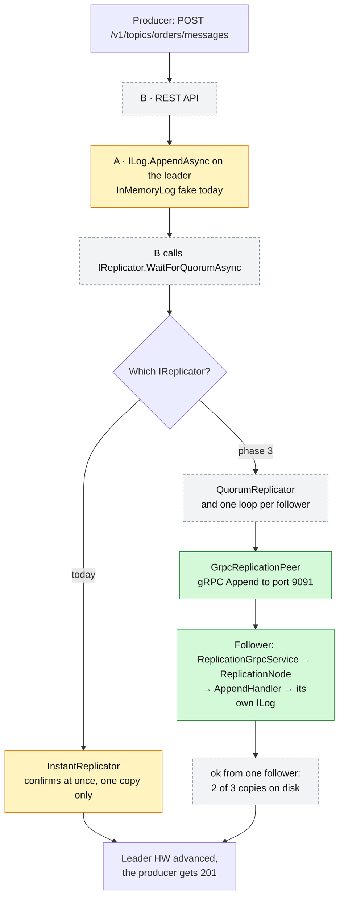
```mermaid
flowchart TD
    P["Producer: POST /v1/topics/orders/messages"] --> API["B · REST API"]:::notyet
    API --> LA["A · ILog.AppendAsync on the leader<br/>InMemoryLog fake today"]:::fake
    LA --> W["B calls IReplicator.WaitForQuorumAsync"]:::notyet
    W --> Q{"Which IReplicator?"}
    Q -- today --> IR["InstantReplicator<br/>confirms at once, one copy only"]:::fake
    Q -- "phase 3" --> QR["QuorumReplicator<br/>and one loop per follower"]:::notyet
    QR --> GP["GrpcReplicationPeer<br/>gRPC Append to port 9091"]:::built
    GP --> FOL["Follower: ReplicationGrpcService → ReplicationNode<br/>→ AppendHandler → its own ILog"]:::built
    FOL --> ACK["ok from one follower:<br/>2 of 3 copies on disk"]:::notyet
    IR --> HW["Leader HW advanced,<br/>the producer gets 201"]
    ACK --> HW

    classDef built fill:#d3f9d8,stroke:#2b8a3e,color:#111
    classDef fake fill:#fff3bf,stroke:#e67700,color:#111
    classDef notyet fill:#f1f3f5,stroke:#868e96,color:#111,stroke-dasharray:4 3
```

The follower half of the path is finished and tested, and so is the gRPC client the leader will use. What's missing is the leader's loop that decides when to send, and B's API that starts the whole thing. [replication.md §5.1](replication.md#51-the-happy-path) shows the same path as a sequence, with the timing between brokers.

### N2. A normal append, step by step through the code

A follower that is up to date receives the next two records. This is the green path of the map, with the class each step happens in.

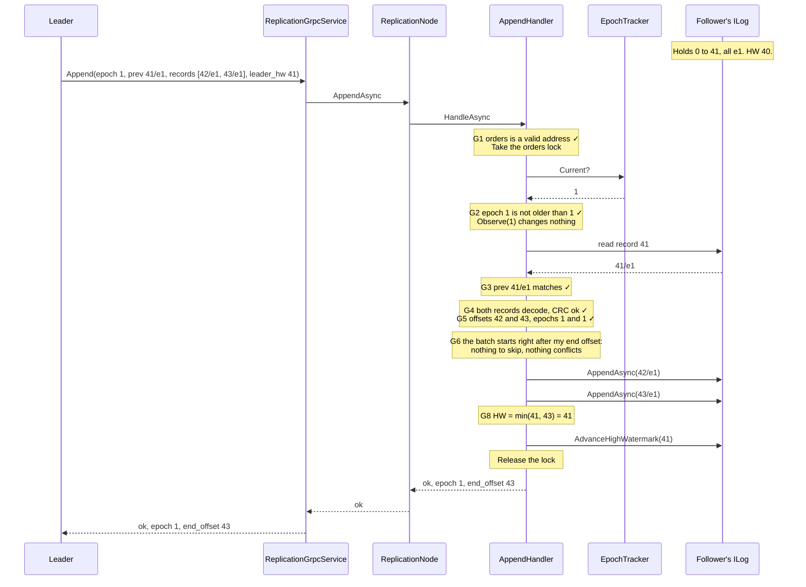
```mermaid
sequenceDiagram
    participant L as Leader
    participant S as ReplicationGrpcService
    participant N as ReplicationNode
    participant H as AppendHandler
    participant E as EpochTracker
    participant LOG as Follower's ILog
    Note over LOG: Holds 0 to 41, all e1. HW 40.
    L->>S: Append(epoch 1, prev 41/e1, records [42/e1, 43/e1], leader_hw 41)
    S->>N: AppendAsync
    N->>H: HandleAsync
    Note over H: G1 orders is a valid address ✓<br/>Take the orders lock
    H->>E: Current?
    E-->>H: 1
    Note over H: G2 epoch 1 is not older than 1 ✓<br/>Observe(1) changes nothing
    H->>LOG: read record 41
    LOG-->>H: 41/e1
    Note over H: G3 prev 41/e1 matches ✓
    Note over H: G4 both records decode, CRC ok ✓<br/>G5 offsets 42 and 43, epochs 1 and 1 ✓
    Note over H: G6 the batch starts right after my end offset:<br/>nothing to skip, nothing conflicts
    H->>LOG: AppendAsync(42/e1)
    H->>LOG: AppendAsync(43/e1)
    Note over H: G8 HW = min(41, 43) = 41
    H->>LOG: AdvanceHighWatermark(41)
    Note over H: Release the lock
    H-->>N: ok, epoch 1, end_offset 43
    N-->>S: ok
    S-->>L: ok, epoch 1, end_offset 43
```

- **Each `AppendAsync` returns only once the record is on disk.** That's the `ILog` contract, so when the follower answers `ok`, its copy counts toward the quorum.
- **The answer's `end_offset` tells the leader how far this follower now is.** In phase 3 the leader uses it to update this follower's progress and to compute the HW.

**Proven by** `Append_after_the_last_record_extends_the_log_and_follows_the_leaders_high_watermark`, plus `Records_fetched_from_one_broker_are_replicated_to_another` for the same thing over real gRPC.

### N3. Steady state: batches and heartbeats

The same follower over time. It shows something that is normal and safe even though it looks odd: **the follower's HW is usually one round behind the leader's.**

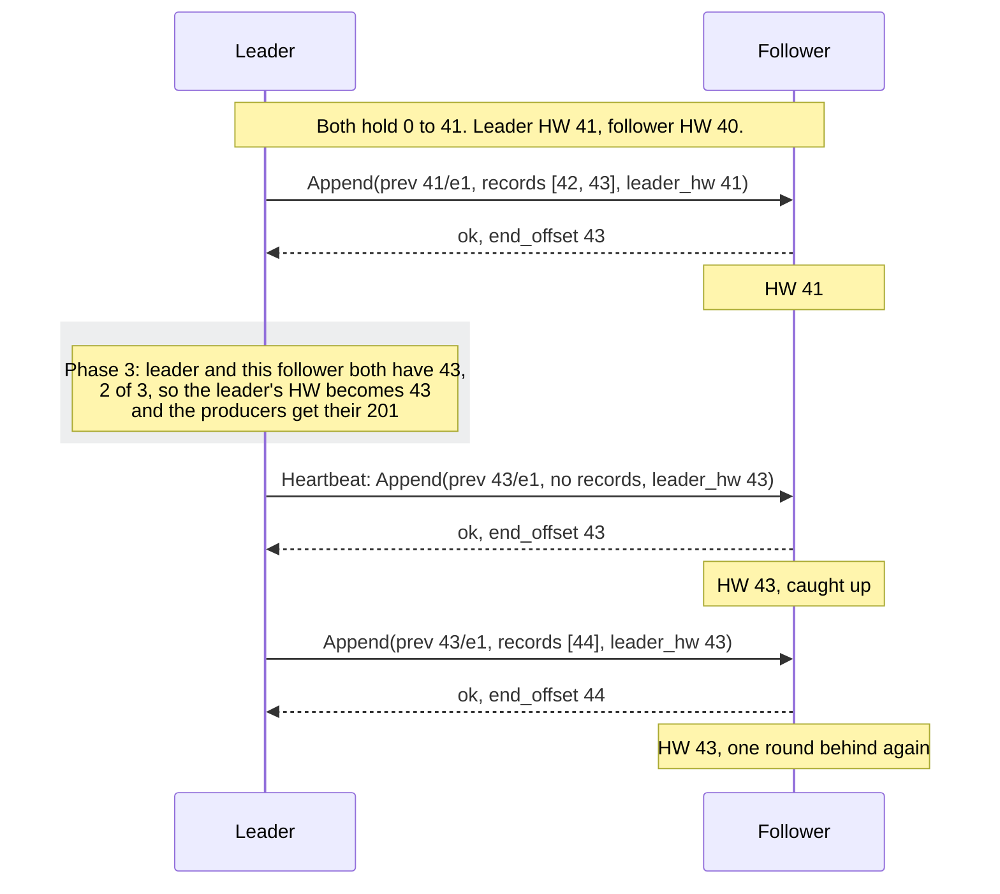
```mermaid
sequenceDiagram
    participant L as Leader
    participant F as Follower
    Note over L,F: Both hold 0 to 41. Leader HW 41, follower HW 40.
    L->>F: Append(prev 41/e1, records [42, 43], leader_hw 41)
    F-->>L: ok, end_offset 43
    Note over F: HW 41
    rect rgba(134, 142, 150, 0.15)
    Note over L: Phase 3: leader and this follower both have 43,<br/>2 of 3, so the leader's HW becomes 43<br/>and the producers get their 201
    end
    L->>F: Heartbeat: Append(prev 43/e1, no records, leader_hw 43)
    F-->>L: ok, end_offset 43
    Note over F: HW 43, caught up
    L->>F: Append(prev 43/e1, records [44], leader_hw 43)
    F-->>L: ok, end_offset 44
    Note over F: HW 43, one round behind again
```

- **The leader learns that a record is confirmed from the follower's answer.** The follower only learns it from the *next* message the leader sends.
- **Heartbeats exist for the quiet moments.** After the last batch of a burst there's no next batch to carry the HW, so a periodic empty `Append` (phase 3) delivers it.
- **That one-round lag is harmless for reads** (clients read up to the leader's HW). It's exactly what makes failover delicate (§18).

**Proven by** `Heartbeat_moves_the_high_watermark_up_to_the_leaders` for the follower side. The leader side arrives in phase 3.

### N4. Reading a broker's state and records

The two read-only operations, as a phase-3 or phase-4 broker will use them: `GetState` to see where another broker is, and `Fetch` to copy what it has.

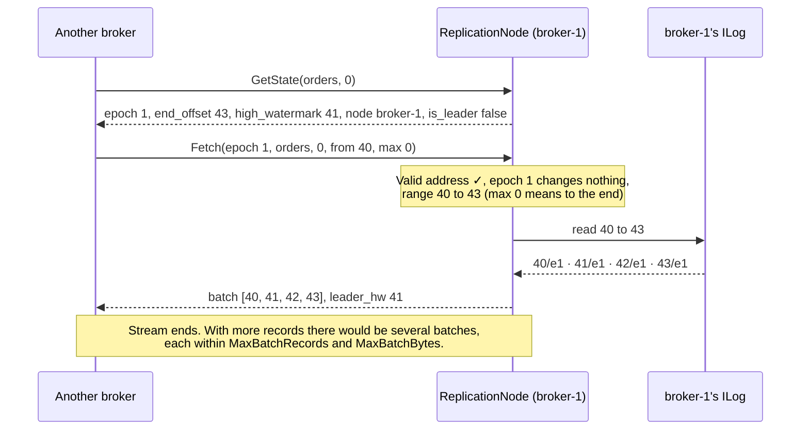
```mermaid
sequenceDiagram
    participant R as Another broker
    participant N as ReplicationNode (broker-1)
    participant LOG as broker-1's ILog
    R->>N: GetState(orders, 0)
    N-->>R: epoch 1, end_offset 43, high_watermark 41, node broker-1, is_leader false
    R->>N: Fetch(epoch 1, orders, 0, from 40, max 0)
    Note over N: Valid address ✓, epoch 1 changes nothing,<br/>range 40 to 43 (max 0 means to the end)
    N->>LOG: read 40 to 43
    LOG-->>N: 40/e1 · 41/e1 · 42/e1 · 43/e1
    N-->>R: batch [40, 41, 42, 43], leader_hw 41
    Note over R,N: Stream ends. With more records there would be several batches,<br/>each within MaxBatchRecords and MaxBatchBytes.
```

- **`Fetch` returns records above the HW too** (42 and 43 here), because whoever is catching up needs them.
- **Every batch says how much of it is confirmed** (`leader_hw`), so the receiver knows which records it can treat as safe.
- **Neither call writes anything.** The only side effect is adopting a newer epoch if the request carries one (§3).

**Proven by** `GetState_reports_epoch_offsets_and_role`, `Fetch_streams_the_log_in_batches_of_at_most_MaxBatchRecords`, `Fetch_does_not_stop_at_the_high_watermark_and_reports_it`.

---

## Part 2 · Failure scenarios and guardrails

## 0. The map: every check an Append goes through

Every `Append` a follower receives goes through these gates, in this order. When every answer is yes (the green path), that's the normal flow from [N2](#n2-a-normal-append-step-by-step-through-the-code). Each later section zooms into one gate.

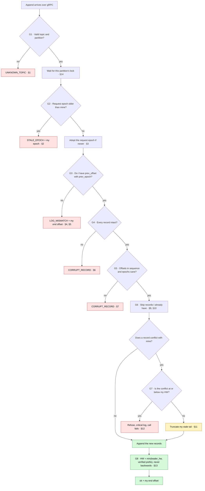
```mermaid
flowchart TD
    IN["Append arrives over gRPC"] --> G1{"G1 · Valid topic and partition?"}
    G1 -- no --> X1["UNKNOWN_TOPIC · §1"]:::bad
    G1 -- yes --> LOCK["Wait for this partition's lock · §14"]
    LOCK --> G2{"G2 · Request epoch older than mine?"}
    G2 -- yes --> X2["STALE_EPOCH + my epoch · §2"]:::bad
    G2 -- no --> AD["Adopt the request epoch if newer · §3"]
    AD --> G3{"G3 · Do I have prev_offset with prev_epoch?"}
    G3 -- no --> X3["LOG_MISMATCH + my end offset · §4, §5"]:::bad
    G3 -- yes --> G4{"G4 · Every record intact?"}
    G4 -- no --> X4["CORRUPT_RECORD · §6"]:::bad
    G4 -- yes --> G5{"G5 · Offsets in sequence and epochs sane?"}
    G5 -- no --> X5["CORRUPT_RECORD · §7"]:::bad
    G5 -- yes --> G6["G6 · Skip records I already have · §9, §10"]
    G6 --> C{"Does a record conflict with mine?"}
    C -- no --> W["Append the new records"]:::ok
    C -- yes --> G7{"G7 · Is the conflict at or below my HW?"}
    G7 -- yes --> X7["Refuse, critical log, call fails · §12"]:::bad
    G7 -- no --> T["Truncate my stale tail · §11"]:::warn
    T --> W
    W --> G8["G8 · HW = min(leader_hw, verified prefix), never backwards · §13"]:::ok
    G8 --> OK["ok + my end offset"]:::ok

    classDef ok fill:#d3f9d8,stroke:#2b8a3e,color:#111
    classDef bad fill:#ffe3e3,stroke:#c92a2a,color:#111
    classDef warn fill:#fff3bf,stroke:#e67700,color:#111
```

Two design rules hold the order together:

- **Nothing is written until every check has passed.** Gates G1 to G5 only read. A rejected request leaves the log exactly as it was.
- **The cheapest and most important checks come first.** An invalid address never even gets a lock. A request from a replaced leader is turned away before any record is looked at.

All of it lives in [AppendHandler.cs](../src/K0sStreams.Replication/AppendHandler.cs).

---

## 1. A request names an invalid topic or partition

**When it happens.** A bug on the sending side, or anything on the network that can reach port 9091. The topic name becomes a folder on disk, so a name like `../etc` would be a path-traversal attack on the storage layer.

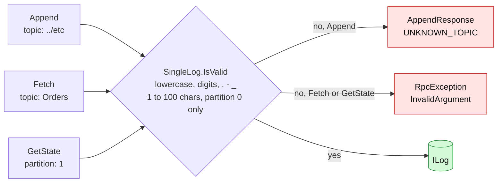
```mermaid
flowchart LR
    V{"SingleLog.IsValid<br/>lowercase, digits, . - _<br/>1 to 100 chars, partition 0 only"}
    A["Append<br/>topic: ../etc"] --> V
    F["Fetch<br/>topic: Orders"] --> V
    S["GetState<br/>partition: 1"] --> V
    V -- "no, Append" --> R1["AppendResponse<br/>UNKNOWN_TOPIC"]:::bad
    V -- "no, Fetch or GetState" --> R2["RpcException<br/>InvalidArgument"]:::bad
    V -- yes --> LOG[("ILog")]:::ok

    classDef ok fill:#d3f9d8,stroke:#2b8a3e,color:#111
    classDef bad fill:#ffe3e3,stroke:#c92a2a,color:#111
```

| Request | Accepted? | Why |
| --- | --- | --- |
| `orders`, partition 0 | ✅ | |
| `../etc` | ❌ | Must start with a lowercase letter or digit; `/` is not allowed |
| `Orders` | ❌ | Uppercase |
| empty name | ❌ | At least one character |
| `orders`, partition 1 (or any but 0) | ❌ | Every topic is a single log (DEC-001); 0 is also the protobuf default, so senders can leave it out |

**Guardrail.** Every operation validates the address with the same rules as topic creation (`TopicConfig.IsValidName`) before any other step. Because the check runs before taking the topic's lock, junk names don't even create a lock entry in memory.

**Where.** [SingleLog.cs](../src/K0sStreams.Replication/SingleLog.cs), called from `AppendHandler.HandleAsync` and `ReplicationNode.EnsureValid`.

---

## 2. A replaced leader keeps writing

**When it happens.** The leader freezes (a long garbage-collection pause, a network blip), its Lease expires and another broker takes over. The old leader wakes up still believing it's in charge. This is the classic split-brain risk.

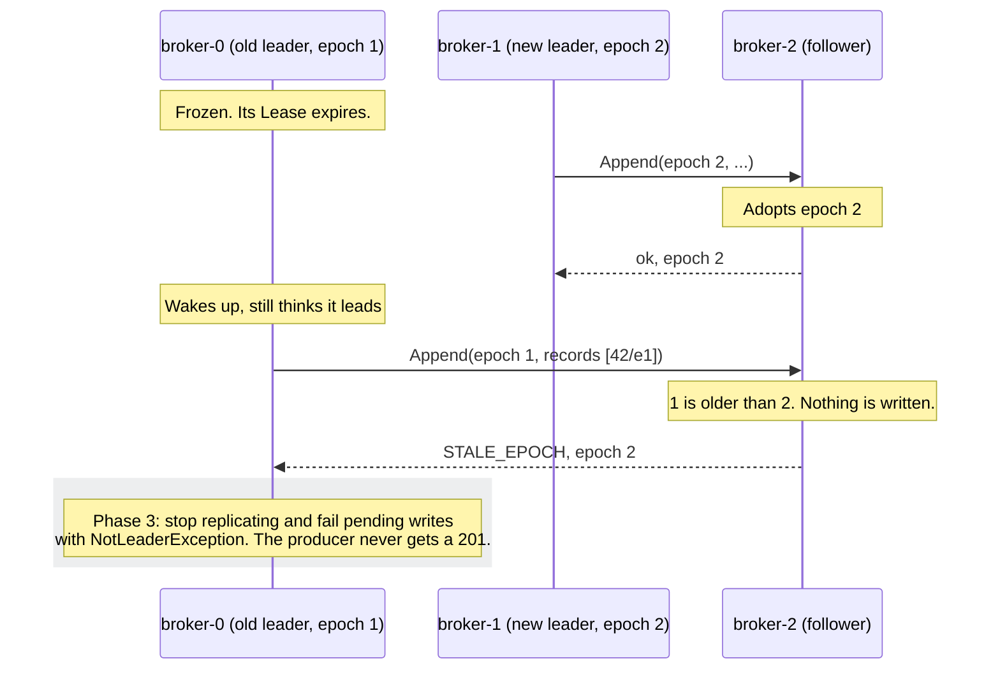
```mermaid
sequenceDiagram
    participant B0 as broker-0 (old leader, epoch 1)
    participant B1 as broker-1 (new leader, epoch 2)
    participant B2 as broker-2 (follower)
    Note over B0: Frozen. Its Lease expires.
    B1->>B2: Append(epoch 2, ...)
    Note over B2: Adopts epoch 2
    B2-->>B1: ok, epoch 2
    Note over B0: Wakes up, still thinks it leads
    B0->>B2: Append(epoch 1, records [42/e1])
    Note over B2: 1 is older than 2. Nothing is written.
    B2-->>B0: STALE_EPOCH, epoch 2
    rect rgba(134, 142, 150, 0.15)
    Note over B0: Phase 3: stop replicating and fail pending writes<br/>with NotLeaderException. The producer never gets a 201.
    end
```

**Guardrail.** Gate G2. A request whose epoch is older than this broker's is rejected before anything else is looked at. The answer carries this broker's epoch, so the old leader learns it has been replaced.

**How far this protects.** The old leader needs 2 of 3 copies to confirm anything. The new leader refuses it (its own epoch is already 2), and so does every follower that has heard of epoch 2. That leaves one opening: the remaining follower, for the short time before the new leader or coordination reaches it. Closing that window is part of the phase-4 promotion step, where the new leader announces its epoch to every peer before doing anything else (§18).

**Where.** `AppendHandler.AppendAsync`, using `EpochTracker.Current`.

---

## 3. The new leader is faster than coordination

**When it happens.** Right after a failover, the new leader starts replicating immediately. But each broker learns about the Lease change through its own coordination code (D), which may take a moment. For a short window the follower's `IClusterState` still says "epoch 1".

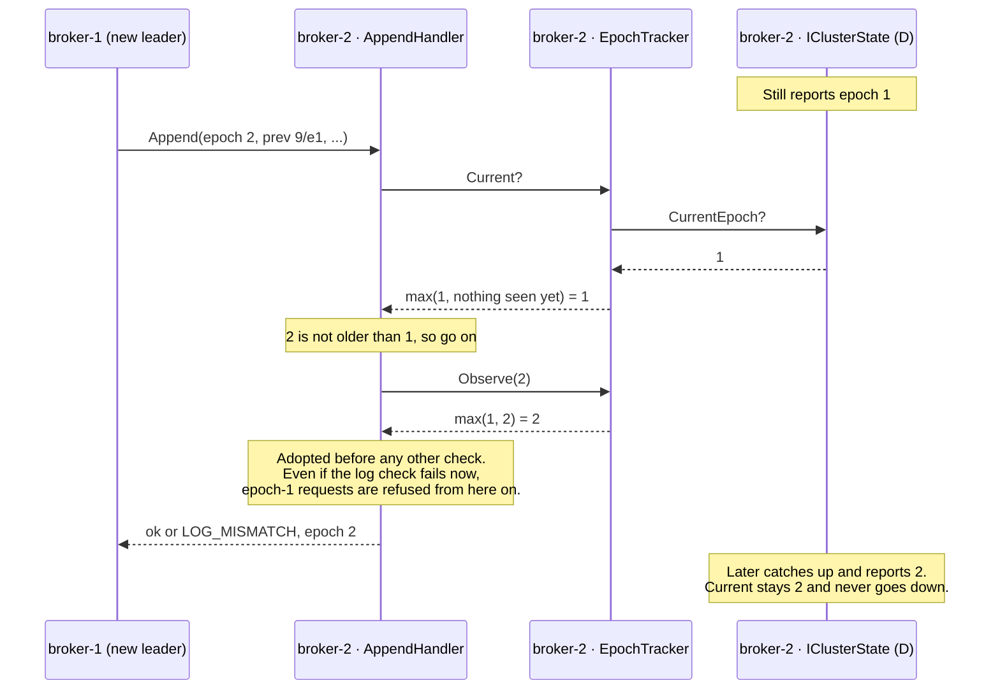
```mermaid
sequenceDiagram
    participant L as broker-1 (new leader)
    participant H as broker-2 · AppendHandler
    participant E as broker-2 · EpochTracker
    participant D as broker-2 · IClusterState (D)
    Note over D: Still reports epoch 1
    L->>H: Append(epoch 2, prev 9/e1, ...)
    H->>E: Current?
    E->>D: CurrentEpoch?
    D-->>E: 1
    E-->>H: max(1, nothing seen yet) = 1
    Note over H: 2 is not older than 1, so go on
    H->>E: Observe(2)
    E-->>H: max(1, 2) = 2
    Note over H: Adopted before any other check.<br/>Even if the log check fails now,<br/>epoch-1 requests are refused from here on.
    H-->>L: ok or LOG_MISMATCH, epoch 2
    Note over D: Later catches up and reports 2.<br/>Current stays 2 and never goes down.
```

**Guardrail.** This broker's epoch is the higher of two sources: what coordination says, and the highest epoch accepted from a leader. A newer epoch is adopted *as soon as it's seen*, before the log checks. That way the old leader is fenced even if the first append from the new leader fails (for example on a log mismatch).

**Where.** [EpochTracker.cs](../src/K0sStreams.Replication/EpochTracker.cs). `Observe` is safe under concurrent calls and only ever moves the epoch up.

---

## 4. The follower is behind

**When it happens.** The follower was down, restarted, or is simply slow. The leader sends the next records assuming the follower has everything before them.

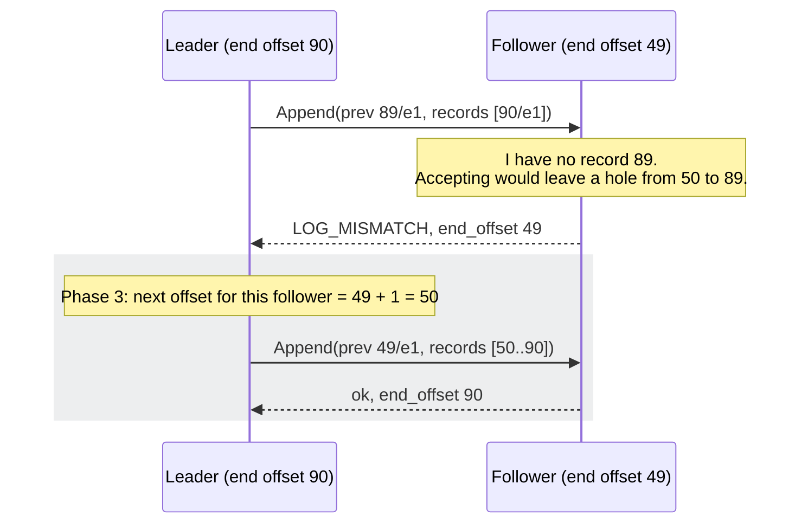
```mermaid
sequenceDiagram
    participant L as Leader (end offset 90)
    participant F as Follower (end offset 49)
    L->>F: Append(prev 89/e1, records [90/e1])
    Note over F: I have no record 89.<br/>Accepting would leave a hole from 50 to 89.
    F-->>L: LOG_MISMATCH, end_offset 49
    rect rgba(134, 142, 150, 0.15)
    Note over L: Phase 3: next offset for this follower = 49 + 1 = 50
    L->>F: Append(prev 49/e1, records [50..90])
    F-->>L: ok, end_offset 90
    end
```

**Guardrail.** Gate G3. A follower only accepts a batch that starts right after a record it already has. Its log can never have holes, which is what makes "offsets are contiguous" true on every broker. The rejection includes the follower's end offset, so the leader can jump straight back instead of probing one offset at a time.

**Where.** `AppendHandler.HasRecordAsync`.

---

## 5. The follower's history differs just before the batch

**When it happens.** The follower has a record at the previous offset, but it was written in a different epoch, by a different leader. From that point on the two logs tell different stories.

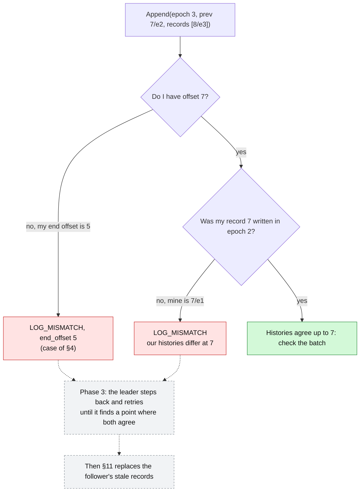
```mermaid
flowchart TD
    R["Append(epoch 3, prev 7/e2, records [8/e3])"] --> H{"Do I have offset 7?"}
    H -- "no, my end offset is 5" --> M1["LOG_MISMATCH, end_offset 5<br/>(case of §4)"]:::bad
    H -- yes --> E{"Was my record 7 written in epoch 2?"}
    E -- "no, mine is 7/e1" --> M2["LOG_MISMATCH<br/>our histories differ at 7"]:::bad
    E -- yes --> NEXT["Histories agree up to 7: check the batch"]:::ok
    M1 -.-> B["Phase 3: the leader steps back and retries<br/>until it finds a point where both agree"]:::future
    M2 -.-> B
    B -.-> FIX["Then §11 replaces the follower's stale records"]:::future

    classDef ok fill:#d3f9d8,stroke:#2b8a3e,color:#111
    classDef bad fill:#ffe3e3,stroke:#c92a2a,color:#111
    classDef future fill:#f1f3f5,stroke:#868e96,color:#111,stroke-dasharray:4 3
```

**Guardrail.** Gate G3 compares the epoch too, not just the offset. Two records with the same offset and the same epoch are guaranteed to be the same record, because one leader writes each epoch and never rewrites its own offsets. So "same offset and epoch at the previous position" means "identical history up to here". This is the same consistency check Raft uses.

**Where.** `AppendHandler.HasRecordAsync`.

---

## 6. Damaged bytes

**When it happens.** A bit flips on the leader's disk or in memory, or a buggy sender cuts a record short or adds garbage after it.

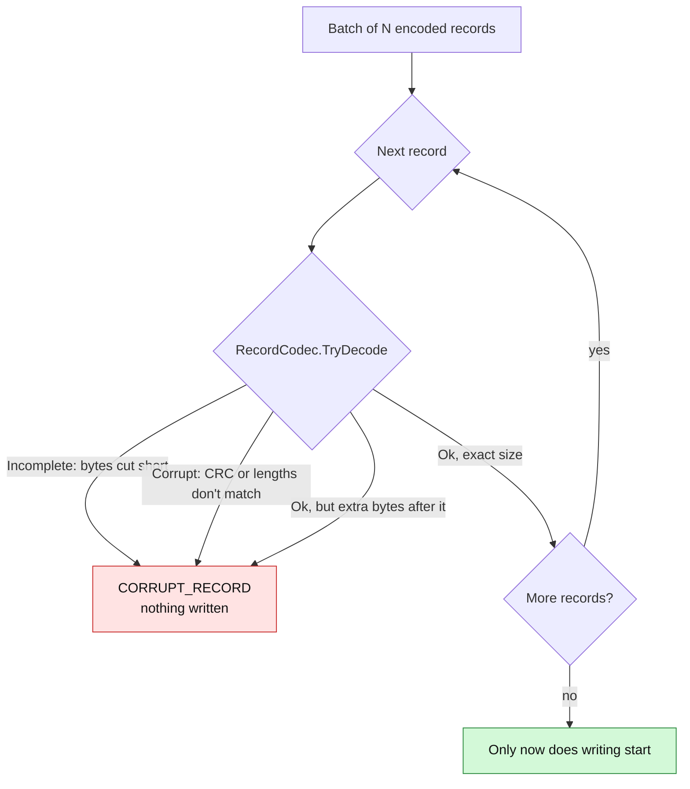
```mermaid
flowchart TD
    B["Batch of N encoded records"] --> L{"Next record"}
    L --> D{"RecordCodec.TryDecode"}
    D -- "Incomplete: bytes cut short" --> X["CORRUPT_RECORD<br/>nothing written"]:::bad
    D -- "Corrupt: CRC or lengths don't match" --> X
    D -- "Ok, but extra bytes after it" --> X
    D -- "Ok, exact size" --> N{"More records?"}
    N -- yes --> L
    N -- no --> W["Only now does writing start"]:::ok

    classDef ok fill:#d3f9d8,stroke:#2b8a3e,color:#111
    classDef bad fill:#ffe3e3,stroke:#c92a2a,color:#111
```

**Guardrail.** Gate G4. Every record carries a CRC32 over its content (the same format as on disk). The whole batch is decoded and checked first. If any record fails, the follower answers `CORRUPT_RECORD` and writes nothing, so a damaged record can never land on a second disk.

**One caveat.** This all-or-nothing rule covers *validation*. The writes themselves happen one by one, so if the follower's own disk failed halfway, part of the batch would be written. That's still safe: the log stays a valid prefix, and the leader's retry skips what's already there (§9).

**Where.** `AppendHandler.TryDecode`, using [RecordCodec](../src/K0sStreams.Contracts/RecordCodec.cs).

---

## 7. A batch that cannot be right

**When it happens.** The bytes are intact but the content is impossible, which points to a bug on the sending side.

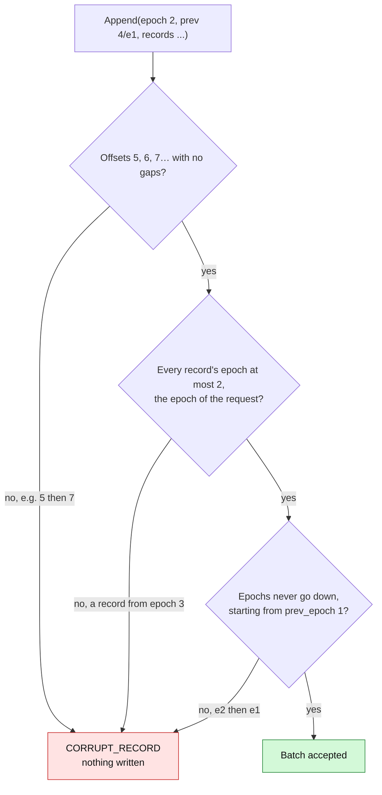
```mermaid
flowchart TD
    S["Append(epoch 2, prev 4/e1, records ...)"] --> O{"Offsets 5, 6, 7… with no gaps?"}
    O -- "no, e.g. 5 then 7" --> X["CORRUPT_RECORD<br/>nothing written"]:::bad
    O -- yes --> E1{"Every record's epoch at most 2,<br/>the epoch of the request?"}
    E1 -- "no, a record from epoch 3" --> X
    E1 -- yes --> E2{"Epochs never go down,<br/>starting from prev_epoch 1?"}
    E2 -- "no, e2 then e1" --> X
    E2 -- yes --> OK["Batch accepted"]:::ok

    classDef ok fill:#d3f9d8,stroke:#2b8a3e,color:#111
    classDef bad fill:#ffe3e3,stroke:#c92a2a,color:#111
```

**Guardrail.** Gate G5 enforces three facts that are always true of a correct log:

- **Offsets have no gaps.** Otherwise the follower's log would get holes.
- **No record is newer than its sender.** A leader in epoch 2 cannot hold a record from epoch 3.
- **Epochs only go up along the log.** Each new leader has a higher epoch than the last.

The protocol's comparisons (§5, §11) rely on these facts, so a batch that breaks them is refused rather than stored.

**Where.** `AppendHandler.TryDecode`.

---

## 8. A very large record

**When it happens.** A producer publishes a big payload. Records can be up to 16 MiB, but gRPC by default rejects messages above 4 MB.

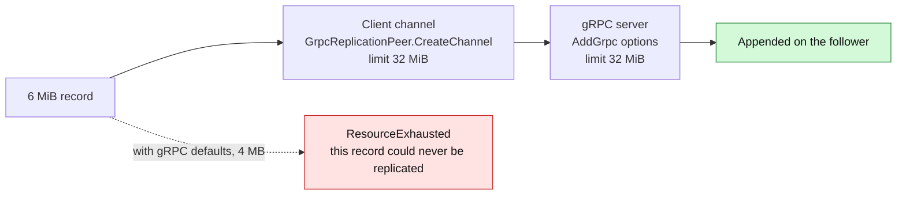
```mermaid
flowchart LR
    R["6 MiB record"] --> C["Client channel<br/>GrpcReplicationPeer.CreateChannel<br/>limit 32 MiB"]
    C --> S["gRPC server<br/>AddGrpc options<br/>limit 32 MiB"]
    S --> OK["Appended on the follower"]:::ok
    R -.->|"with gRPC defaults, 4 MB"| X["ResourceExhausted<br/>this record could never be replicated"]:::bad

    classDef ok fill:#d3f9d8,stroke:#2b8a3e,color:#111
    classDef bad fill:#ffe3e3,stroke:#c92a2a,color:#111
```

**Guardrail.** Both ends raise the limit to 32 MiB, twice the largest record. Batches are kept small anyway (`MaxBatchBytes`, 1 MiB by default, never above 16 MiB). A record bigger than that travels alone in its batch, so no batch ever gets near the limit.

**Where.** `ReplicationOptions.MaxMessageSize`, `GrpcReplicationPeer.CreateChannel`, `AddK0sReplication`.

---

## 9. The leader retries an append that already succeeded

**When it happens.** The follower wrote the records, but the answer got lost or arrived after the leader's timeout. The leader, not knowing, sends the same thing again.

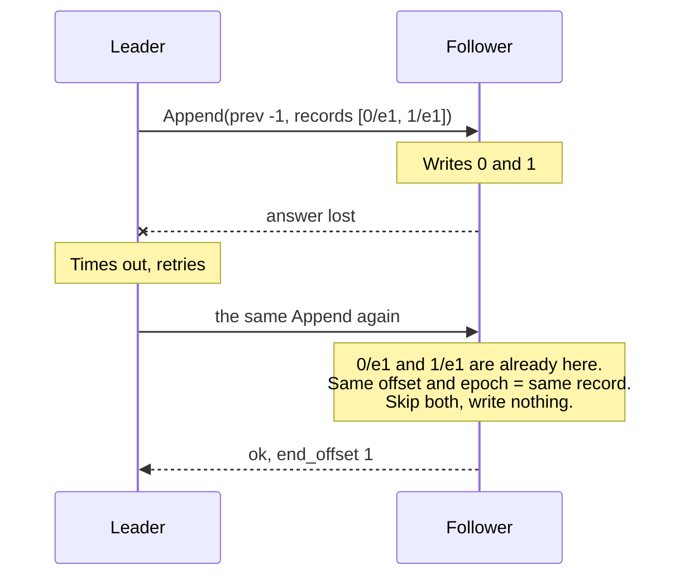
```mermaid
sequenceDiagram
    participant L as Leader
    participant F as Follower
    L->>F: Append(prev -1, records [0/e1, 1/e1])
    Note over F: Writes 0 and 1
    F--xL: answer lost
    Note over L: Times out, retries
    L->>F: the same Append again
    Note over F: 0/e1 and 1/e1 are already here.<br/>Same offset and epoch = same record.<br/>Skip both, write nothing.
    F-->>L: ok, end_offset 1
```

**Guardrail.** Gate G6. Before writing, the follower compares the batch with what it already has and skips the matching part. Retries are harmless, which the leader's loop in phase 3 relies on: it can always simply resend.

**Where.** `AppendHandler.SkipExistingAsync`.

---

## 10. An old, shorter request arrives late

**When it happens.** The network delays one request so long that a newer, longer one overtakes it.

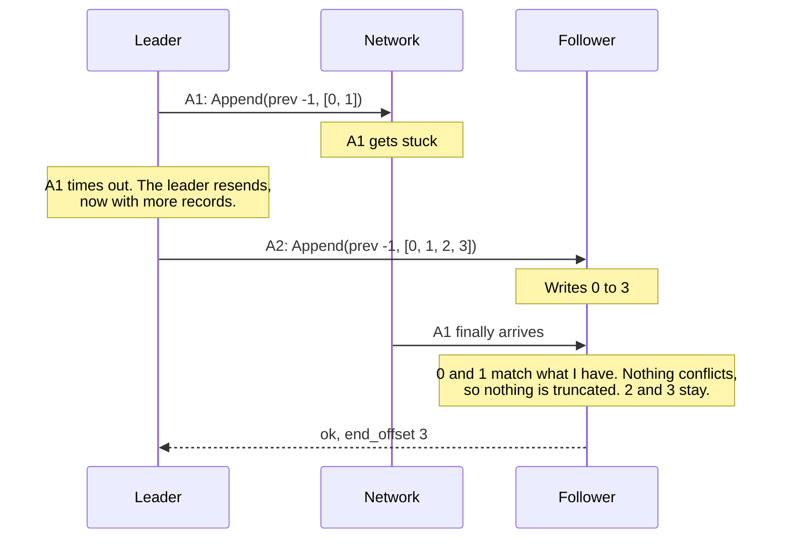
```mermaid
sequenceDiagram
    participant L as Leader
    participant N as Network
    participant F as Follower
    L->>N: A1: Append(prev -1, [0, 1])
    Note over N: A1 gets stuck
    Note over L: A1 times out. The leader resends,<br/>now with more records.
    L->>F: A2: Append(prev -1, [0, 1, 2, 3])
    Note over F: Writes 0 to 3
    N->>F: A1 finally arrives
    Note over F: 0 and 1 match what I have. Nothing conflicts,<br/>so nothing is truncated. 2 and 3 stay.
    F-->>L: ok, end_offset 3
```

**Guardrail.** Gate G6 truncates **only on an actual conflict**. A tempting shortcut, "the batch ends at 1, so delete everything after 1", would throw away records 2 and 3 here, and they may already be confirmed. Raft's rules make the same point.

The late request also can't drag the high watermark down (§13).

**Where.** `AppendHandler.SkipExistingAsync`.

---

## 11. The follower holds records from an old leader

**When it happens.** An old leader wrote some records to this follower and then died before they reached a majority. They were never confirmed, and the new leader has different records at those offsets.

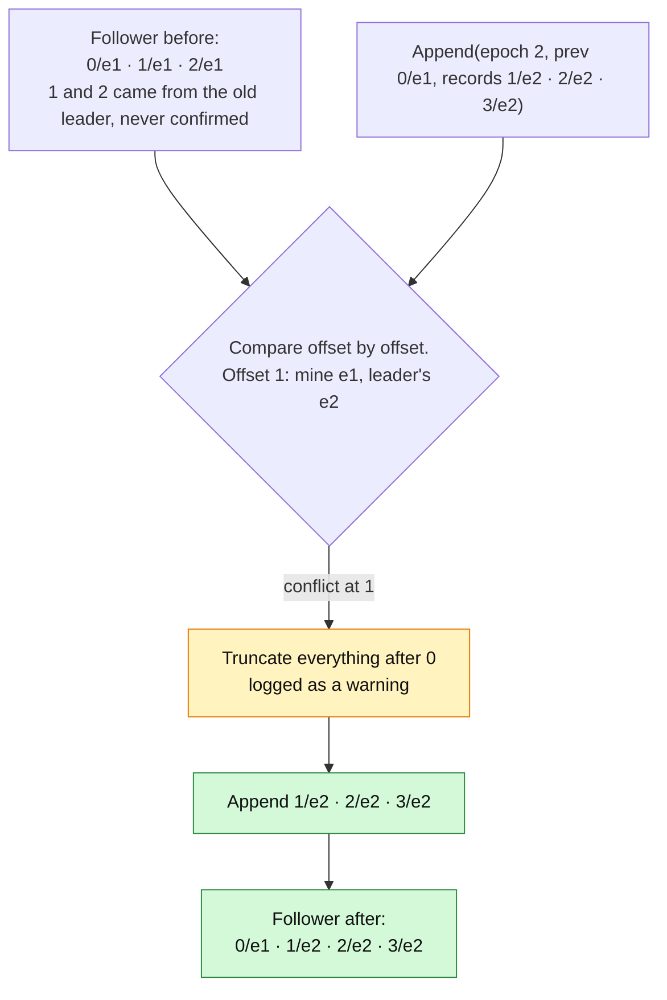
```mermaid
flowchart TD
    FB["Follower before:<br/>0/e1 · 1/e1 · 2/e1<br/>1 and 2 came from the old leader, never confirmed"]
    REQ["Append(epoch 2, prev 0/e1, records 1/e2 · 2/e2 · 3/e2)"]
    FB --> CMP{"Compare offset by offset.<br/>Offset 1: mine e1, leader's e2"}
    REQ --> CMP
    CMP -- "conflict at 1" --> T["Truncate everything after 0<br/>logged as a warning"]:::warn
    T --> A["Append 1/e2 · 2/e2 · 3/e2"]:::ok
    A --> FA["Follower after:<br/>0/e1 · 1/e2 · 2/e2 · 3/e2"]:::ok

    classDef ok fill:#d3f9d8,stroke:#2b8a3e,color:#111
    classDef warn fill:#fff3bf,stroke:#e67700,color:#111
```

A second case: if the follower has `0/e1 · 1/e1 · 2/e1` and the batch is `0/e1 · 1/e1 · 2/e2`, offsets 0 and 1 match and are kept; only 2 is replaced.

**Guardrail.** Gates G6 and G7. Records before the first conflict are kept. From the first conflict on, the follower's tail is truncated and replaced by the leader's version. That's how all logs converge on the leader's history. Every truncation is logged as a warning, so chaos tests can see when it happens.

**Where.** `AppendHandler.SkipExistingAsync` and `TruncateDivergentTailAsync`.

---

## 12. The leader contradicts confirmed data

**When it happens.** It shouldn't, ever. A conflict at an offset this follower already counts as confirmed means two leaders disagree about a message a producer was told was safe. That can only come from a protocol bug, such as the failover hole described in §18.

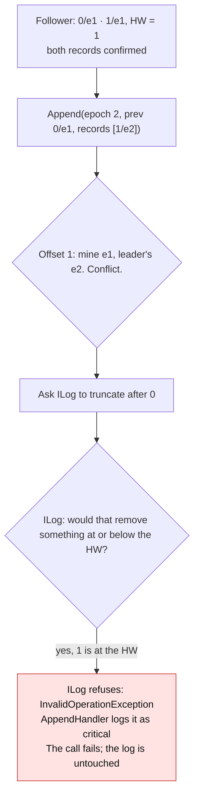
```mermaid
flowchart TD
    S["Follower: 0/e1 · 1/e1, HW = 1<br/>both records confirmed"] --> R["Append(epoch 2, prev 0/e1, records [1/e2])"]
    R --> C{"Offset 1: mine e1, leader's e2. Conflict."}
    C --> T["Ask ILog to truncate after 0"]
    T --> G{"ILog: would that remove something at or below the HW?"}
    G -- "yes, 1 is at the HW" --> X["ILog refuses: InvalidOperationException<br/>AppendHandler logs it as critical<br/>The call fails; the log is untouched"]:::bad

    classDef bad fill:#ffe3e3,stroke:#c92a2a,color:#111
```

**Guardrail.** Gate G7, which has two layers. The `ILog` contract (A) refuses to truncate below the high watermark, and the handler logs a critical "conflicts with confirmed data" message and lets the call fail. The leader receives a gRPC error.

**Why fail loudly instead of resolving it.** Deleting would silently lose a message that was acknowledged. Refusing keeps the data and produces an unmistakable signal that chaos tests and logs will catch.

**Where.** `AppendHandler.TruncateDivergentTailAsync` and `ILog.TruncateAsync`.

---

## 13. Deciding what the follower counts as confirmed

**When it happens.** On every `Append` and heartbeat. The leader sends its high watermark (`leader_hw`), and the follower decides how much of its own log it may mark as confirmed.

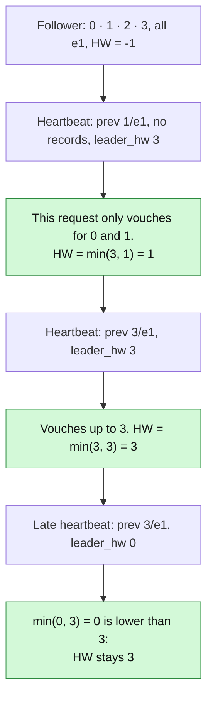
```mermaid
flowchart TD
    S["Follower: 0 · 1 · 2 · 3, all e1, HW = -1"] --> H1["Heartbeat: prev 1/e1, no records, leader_hw 3"]
    H1 --> M1["This request only vouches for 0 and 1.<br/>HW = min(3, 1) = 1"]:::ok
    M1 --> H2["Heartbeat: prev 3/e1, leader_hw 3"]
    H2 --> M2["Vouches up to 3. HW = min(3, 3) = 3"]:::ok
    M2 --> H3["Late heartbeat: prev 3/e1, leader_hw 0"]
    H3 --> M3["min(0, 3) = 0 is lower than 3:<br/>HW stays 3"]:::ok

    classDef ok fill:#d3f9d8,stroke:#2b8a3e,color:#111
```

**Guardrail.** Gate G8:

- **Never past the verified prefix.** A request only proves that the follower agrees with the leader up to the end of that request. Beyond it, the follower may still hold stale records from an old leader (§11). Marking those as confirmed would let clients read data that's about to be replaced.
- **Never backwards.** Requests can arrive late (§10) with an older `leader_hw`. The HW only moves up, enforced by both the handler and the `ILog` contract.

**Where.** The last lines of `AppendHandler.AppendAsync`.

---

## 14. Two requests for the same topic at once

**When it happens.** A retry overlaps with the original request, or a heartbeat arrives while a batch is still being written.

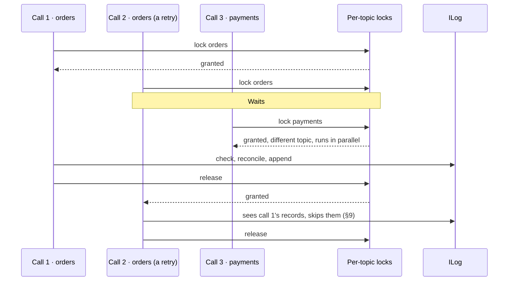
```mermaid
sequenceDiagram
    participant R1 as Call 1 · orders
    participant R2 as Call 2 · orders (a retry)
    participant R3 as Call 3 · payments
    participant G as Per-topic locks
    participant LOG as ILog
    R1->>G: lock orders
    G-->>R1: granted
    R2->>G: lock orders
    Note over R2,G: Waits
    R3->>G: lock payments
    G-->>R3: granted, different topic, runs in parallel
    R1->>LOG: check, reconcile, append
    R1->>G: release
    G-->>R2: granted
    R2->>LOG: sees call 1's records, skips them (§9)
    R2->>G: release
```

**Guardrail.** Appends to the same topic run one at a time. The handler reads the log, decides, and then writes; if two calls interleaved, both could decide to write the same offset, or one could truncate what the other just wrote. Different topics don't block each other.

**Where.** The lock in `AppendHandler.HandleAsync` (one `SemaphoreSlim` per topic).

---

## 15. A broker asks for records (`Fetch`)

**When it happens.** Today only in tests. From phase 3 on, a lagging follower can use it to catch up, and in phase 4 a new leader uses it to collect records it's missing (§18).

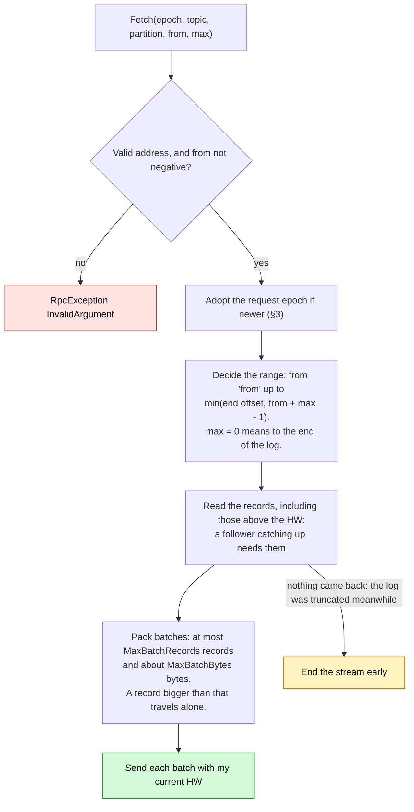
```mermaid
flowchart TD
    F["Fetch(epoch, topic, partition, from, max)"] --> V{"Valid address, and from not negative?"}
    V -- no --> X["RpcException InvalidArgument"]:::bad
    V -- yes --> E["Adopt the request epoch if newer (§3)"]
    E --> LST["Decide the range: from 'from' up to<br/>min(end offset, from + max - 1).<br/>max = 0 means to the end of the log."]
    LST --> RD["Read the records, including those above the HW:<br/>a follower catching up needs them"]
    RD --> PK["Pack batches: at most MaxBatchRecords records<br/>and about MaxBatchBytes bytes.<br/>A record bigger than that travels alone."]
    PK --> SEND["Send each batch with my current HW"]:::ok
    RD -- "nothing came back: the log was truncated meanwhile" --> STOP["End the stream early"]:::warn

    classDef ok fill:#d3f9d8,stroke:#2b8a3e,color:#111
    classDef bad fill:#ffe3e3,stroke:#c92a2a,color:#111
    classDef warn fill:#fff3bf,stroke:#e67700,color:#111
```

**Guardrails.** Address validation (§1); bounded batches, so no message gets near the gRPC limit (§8); an early stop if the log shrinks underneath the reader.

**What it deliberately doesn't do.** It doesn't take the partition lock, because a long catch-up stream must not block incoming appends. Whoever receives the records doesn't need it either: it writes them with `Append`, whose gate G3 (§4, §5) rejects anything that doesn't line up.

**Where.** `ReplicationNode.FetchAsync`.

---

## 16. The other broker is down or slow

**When it happens.** A follower's pod is restarting, its node is gone, or it's overloaded.

```mermaid
flowchart TD
    C["Calling another broker<br/>through GrpcReplicationPeer"] --> K{"Which call?"}
    K -- "Append or GetState" --> D["Deadline = now + RpcTimeout (2 s by default),<br/>measured with TimeProvider"]
    K -- "Fetch, a catch-up stream" --> N["No deadline: a long catch-up is legitimate.<br/>Ends with the caller's cancellation."]
    D --> R{"Outcome"}
    R -- "answer in time" --> OK["Response"]:::ok
    R -- "connection refused" --> U["RpcException Unavailable"]:::bad
    R -- "no answer in time" --> T["RpcException DeadlineExceeded"]:::bad
    U -.-> P["Phase 3: mark this follower as lagging,<br/>keep confirming with the other one, retry later"]:::future
    T -.-> P

    classDef ok fill:#d3f9d8,stroke:#2b8a3e,color:#111
    classDef bad fill:#ffe3e3,stroke:#c92a2a,color:#111
    classDef future fill:#f1f3f5,stroke:#868e96,color:#111,stroke-dasharray:4 3
```

**Guardrail.** Every short call has a deadline, so a dead or frozen follower can't make the leader wait forever. With 2 of 3 needed, the leader keeps working as long as one follower answers. Time goes through `TimeProvider`, so phase 3 tests can simulate slowness without real waits.

**Coverage.** The unreachable case is tested. The slow case (`DeadlineExceeded`) isn't yet; it needs `FakeTimeProvider`, planned for phase 3.

**Where.** [GrpcReplicationPeer.cs](../src/K0sStreams.Replication/GrpcReplicationPeer.cs).

---

## 17. The configuration is wrong

**When it happens.** A typo in `appsettings.json`, an environment variable or a Kubernetes manifest.

```mermaid
flowchart TD
    ST["Broker starts"] --> B["Read the Replication section"]
    B --> V{"RpcTimeout above zero?<br/>MaxBatchRecords at least 1?<br/>MaxBatchBytes between 1 byte and 16 MiB?<br/>Every peer an absolute URL?"}
    V -- "any no" --> X["The broker refuses to start,<br/>with a message naming the section"]:::bad
    V -- "all yes" --> P["PeerDirectory goes through Replication:Peers"]
    P --> SELF{"Is this entry my own NodeId?"}
    SELF -- yes --> SKIP["Skip it: never replicate to myself"]
    SELF -- no --> CH["Create a gRPC channel to it<br/>(connects on first use)"]:::ok

    classDef ok fill:#d3f9d8,stroke:#2b8a3e,color:#111
    classDef bad fill:#ffe3e3,stroke:#c92a2a,color:#111
```

**Guardrails.**

- **Fail at startup, not later.** A bad value stops the broker immediately with a clear message, instead of breaking replication silently in production.
- **Never a peer of itself.** All three brokers can share the same peer list; each one skips its own entry. Replicating to yourself would make a single broker count as two copies, a fake quorum.

**Where.** `ReplicationOptions.IsValid`, `AddK0sReplication` (`ValidateOnStart`), [PeerDirectory.cs](../src/K0sStreams.Replication/PeerDirectory.cs).

---

## 18. Not guarded yet

These guardrails come in later phases or need a team decision. They're listed so nobody assumes they're covered.

| Scenario | What happens today | Planned guardrail | When |
| --- | --- | --- | --- |
| **The new leader is missing confirmed records** (the Lease went to a lagging broker) | A confirmed message can be lost; see the diagram below | Promotion step before accepting writes ([replication.md §10.1](replication.md#101--failover-as-currently-described-can-lose-confirmed-messages-c-d-a)) | Phase 4; needs team agreement |
| **Two brokers both think they lead the same epoch** | `StaticClusterState` makes every broker "leader, epoch 1"; a follower would accept appends from both | Fixed leader from configuration (D), then the real Lease | Phase 3 (fixed leader), phase 4 (Lease) |
| **The old leader reaches the last follower before the new leader does** | A write can still be confirmed under the old epoch for a moment (§2) | The promotion step announces the new epoch to every peer first (`StateRequest.epoch`) | Phase 4 |
| **The old leader keeps going after `STALE_EPOCH`** | Nothing reacts yet: there is no leader side | Fail pending writes with `NotLeaderException`, stop the loops | Phase 3 |
| **Both followers are down** | `InstantReplicator` confirms immediately, so writes "succeed" with one copy | `QuorumReplicator` waits; B gives up after a timeout and answers 503 | Phase 3 |
| **A broker restarts and forgets the epoch it adopted** | It falls back to D's epoch until a leader contacts it again | Persist the epoch, or read it from the last `EpochChange` record in the log | Later |
| **A topic the follower has never heard of** | Accepted for any valid name | Replicated topic metadata ([§10.3](replication.md#103--topics-on-followers-a-b-c-open-topic-1-in-contextomd)) | Team decision |
| **A malicious broker sends an absurd epoch** | Adopted, which fences the real leader | Out of scope: the project assumes no Byzantine faults | — |

### The most important gap, step by step

How the follower-side guardrails above are *not enough* to protect a failover, and why phase 4's promotion step is needed:

```mermaid
sequenceDiagram
    participant B0 as broker-0 (leader, e1)
    participant B1 as broker-1
    participant B2 as broker-2 (lagging)
    B0->>B1: Append(records [42/e1])
    B1-->>B0: ok
    Note over B0: broker-0 and broker-1 have 42.<br/>Confirmed: the producer gets a 201.
    Note over B2: Never received 42
    Note over B0: Crashes before telling broker-1 that HW is 42
    Note over B2: Wins the Lease, epoch 2, end offset 41
    B2->>B1: Append(epoch 2, prev 41/e1, records [42/e2])
    alt broker-1's HW had already reached 42
        Note over B1: §12 safety net: refuse, critical log.<br/>Data kept, but replication is stuck.
    else broker-1's HW is still 41 (the likely case)
        Note over B1: §11 treats 42/e1 as a stale tail and truncates it.<br/>A confirmed message is lost.
    end
```

Every guardrail here does its job; the follower simply can't know that `42/e1` was confirmed, because it learns the HW one round late. The fix has to happen before broker-2 starts leading: it must first collect what the other broker has, as described in replication.md §10.1.
