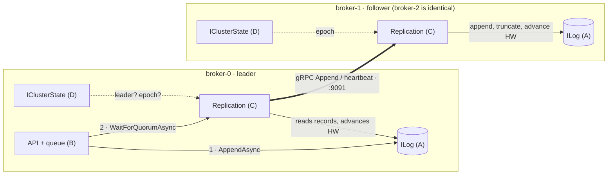
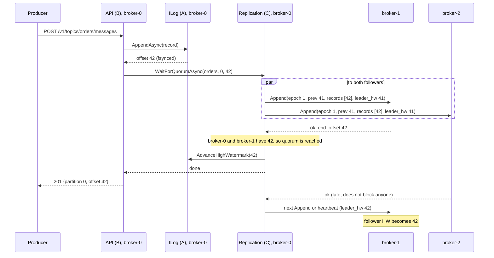
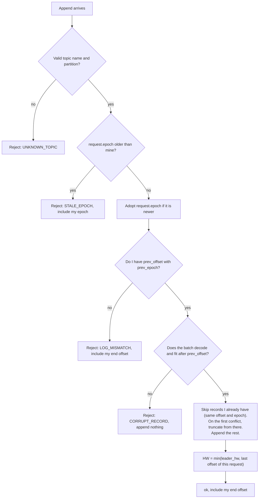

# Replication (block C)

What the replication layer of K0sStreams is for, what it owns, which contracts it talks through, and how we plan to build it in isolation before plugging it into the rest of the broker.

Complements [ARQUITECTURA.md](ARQUITECTURA.md) (overall design) and [contexto.md](contexto.md) (state of the code). What was built in each iteration, and how it was checked, is in [replication-iterations.md](replication-iterations.md). How the code is organized is in [replication-code-guide.md](replication-code-guide.md). Failure scenarios and the guardrail for each are drawn in [replication-scenarios.md](replication-scenarios.md).

> **In one paragraph.** K0sStreams runs as three identical brokers. One of them, the **leader**, accepts writes. The other two, the **followers**, keep copies. Replication turns "the leader wrote it to its disk" into "it is on the disk of at least 2 of the 3 brokers", and only then lets the producer get its `201 OK`. That single rule is what lets us lose any one broker without losing a confirmed message. Replication also decides how far clients may read (the **high watermark**), brings lagging followers back up to date, and rejects writes from a leader that has already been replaced (**fencing**).

---

## 1. The project in one page

**K0sStreams** is a message broker written in .NET 10 for the *Middlewares Distribuidos* course (final delivery: 11 Nov 2026). It runs as 3 pods on a k0s Kubernetes cluster.

The pitch is **"the log that is also a queue"**: every topic can be consumed in two ways over the same data.

| Mode | Similar to | How it works |
| --- | --- | --- |
| History | Kafka | Read from any offset and re-read as often as you like. |
| Work queue | SQS / RabbitMQ | Each message goes to one consumer, who acks or nacks it. Retries with backoff, scheduled messages, dead-letter queue. |

Clients talk HTTP REST on port `9090`. Brokers talk gRPC to each other on port `9091`. Leader election is delegated to a Kubernetes Lease (etcd guarantees a single holder). Epochs and fencing on top of it are ours.

**The decision that shapes everything:** the append-only log is the single source of truth. Even the queue's state (receive, ack, nack, timeout) is stored as records in that same log (event sourcing). For replication this is good news: there is exactly **one** thing to replicate, the log, and messages, queue state and epoch changes all come along with it.

### Who builds what

| Block | Project | Owns |
| --- | --- | --- |
| A, Storage | `K0sStreams.Storage` | On-disk log: segments, index, CRC32, group commit, recovery |
| B, Queue and API | `K0sStreams.Queue`, `K0sStreams.Broker` | Queue engine, REST API and Swagger |
| **C, Replication** | **`K0sStreams.Replication`** | **gRPC between brokers, 2-of-3 quorum, high watermark, follower catch-up** |
| D, Platform and coordination | `K0sStreams.Coordination`, `deploy/`, `chaos/` | CI, Docker, Kubernetes, Lease, epochs, CRD, chaos suite |

Every project depends only on `K0sStreams.Contracts`. While a block doesn't exist yet, the others use an in-memory fake (`InMemoryLog`, `InstantReplicator`, `StaticClusterState`). That is what lets us build replication now, on our own, and plug it in later by changing one line in `AddK0sReplication`.

---

## 2. Why replication exists

**Without replication** there is one disk. If that pod's volume is lost, the data is gone. While the pod is down, nothing works.

**With replication** every confirmed message lives on at least two disks, so any single broker can fail.

**Why 2 of 3 and not 3 of 3?** Waiting for all three means a single slow or dead follower blocks every write. Waiting for a majority (2) tolerates one failure. Majorities also have a property the whole design depends on:

> **Any two majorities of 3 brokers share at least one broker.**

So whoever becomes the next leader, as long as it can talk to one other broker, is guaranteed to find every confirmed message on one of the two. Failover safety (section 5.5) is built on that overlap.

---

## 3. Vocabulary

| Term | Meaning |
| --- | --- |
| **Offset** | Position of a record in a partition: 0, 1, 2… always contiguous. |
| **End offset** | Last offset written to *this* broker's disk. `-1` if empty. |
| **High watermark (HW)** | Last offset confirmed by quorum. Clients only ever see up to here. |
| **Epoch** | A "term of office" number. It goes up by one on every leader change and is stamped on every record. |
| **Quorum** | 2 of 3 brokers. The leader counts as one. |
| **Fencing** | Rejecting anything that carries an older epoch, so a replaced leader can't keep writing. |
| **Divergence** | A follower holds records the leader doesn't, typically written by an old leader that died before replicating them. They were never confirmed and must be overwritten. |
| **Match offset** | How far the leader knows a given follower's log is identical to its own. |

```
offset        0    1    2    3    4    5    6
leader log   [a]  [b]  [c]  [d]  [e]  [f]  [g]
                                 ▲              ▲
                               HW = 4      end offset = 6
             └─── visible to clients ───┘└─ written, not yet confirmed ─┘
```

---

## 4. Where replication sits



Replication is the only block that talks to other brokers. It sits **beside** the log, not on top of it. B writes to the log itself and then asks replication "tell me when this offset is safe".

### What replication provides

| Contract | Used by | Purpose |
| --- | --- | --- |
| `IReplicator.WaitForQuorumAsync(topic, partition, offset)` | B (API and queue engine) | Completes when `offset` is on 2 of 3 disks, after advancing the HW. Throws `NotLeaderException` if this broker stops being leader while waiting. |
| gRPC service `Replication` (`Append`, `Fetch`, `GetState`), port 9091 | Replication on the other brokers | The wire protocol between brokers. Defined in [replication.proto](../src/K0sStreams.Contracts/Protos/replication.proto). |
| `AddK0sReplication` / `MapK0sReplication` | `Program.cs` | Registers `IReplicator` and gRPC, and maps the service. |

### What replication consumes

| Contract | Owner | Used for |
| --- | --- | --- |
| `ILog` | A | Followers: `AppendAsync` with explicit offsets, `TruncateAsync` on divergence. Leader: `ReadAsync` to ship records. Both: `EndOffset`, `HighWatermark`, `AdvanceHighWatermark`. |
| `IClusterState` | D | Am I the leader, what is the current epoch, what is my `NodeId`. `EpochChanged` triggers stepping down. |
| `RecordCodec` | shared | Records travel as the same bytes they have on disk (CRC included). |
| `K0sStreams.Contracts.Grpc` | shared (generated) | `Replication.ReplicationBase` (server) and `Replication.ReplicationClient` (client). |
| `TimeProvider` | host | Heartbeats and timeouts. Tests use `FakeTimeProvider`. |

### Contract rules that matter most to replication

These come from the XML docs in `Contracts` and from [contexto.md](contexto.md):

- `ReadAsync` does **not** stop at the HW. Replication needs the unconfirmed tail; the API is the one that cuts at the HW.
- `AppendAsync` with an explicit offset must be exactly `EndOffset + 1`, otherwise it throws `ArgumentException`.
- `AppendAsync` returns only after fsync. By the time B calls `WaitForQuorumAsync`, the leader's own copy already counts toward the quorum.
- `AdvanceHighWatermark` only moves up, and only replication calls it.
- `TruncateAsync` refuses to cut below the HW. Confirmed data is never deleted.

---

## 5. How it works

### 5.1 The happy path



Two details:

- **What starts the replication?** `ILog` has no "something was appended" notification. B always calls `WaitForQuorumAsync` right after appending, so that call is the signal that wakes up the per-follower loops. A periodic heartbeat covers the rest.
- **Followers learn the HW one round later**, through `leader_hw` in the next `Append` or heartbeat. A follower's HW is therefore almost always slightly behind the leader's. Section 10.1 shows why this matters.

### 5.2 Computing the high watermark

The leader tracks, per partition, the match offset of each broker. Its own value is its end offset. The HW is the highest offset that at least 2 brokers have, which is the **second-highest of the three values**.

| Leader end | broker-1 match | broker-2 match | HW |
| --- | --- | --- | --- |
| 10 | 10 | 3 | **10** |
| 10 | 7 | 3 | **7** |
| 10 | 2 | down | **2** |
| 10 | down | down | unchanged (writes wait) |

One extra rule, borrowed from Raft: the leader only advances the HW by counting copies of a record **from its own epoch**. Records from older epochs become confirmed indirectly, when a newer record after them is confirmed. To make that cheap, each new leader writes an `EpochChange` record (type 5) as its first record. See section 10.1.

### 5.3 What a follower does with an `Append`



- **Topic validation comes first** because the topic name becomes a folder on disk. Names follow `TopicConfig.IsValidName`, so something like `../etc` never reaches the log.
- **"My epoch"** is the highest epoch this broker knows about: the larger of `IClusterState.CurrentEpoch` and the highest epoch it has accepted in an `Append`. A new leader may start sending before this broker's D has noticed the Lease change, so both sources count.
- **Empty log:** `prev_offset = -1` always matches.
- **"Fits after prev_offset"** means every record has a valid CRC and no extra bytes, the offsets are `prev_offset + 1, + 2…` with no gaps, and the epochs never go down and are not newer than the leader's.
- **A conflict with a confirmed record** (below this broker's HW) is never truncated: `ILog` refuses, the handler logs it as critical and the call fails. If it happens, the protocol has a bug.
- **Why `min(leader_hw, last offset of this request)` and not the end offset?** Beyond the records just checked, this follower may still hold stale records from an old leader. Only the prefix that was verified against the leader can be marked as confirmed.
- **Same offset and same epoch means the same record.** That property is what makes retries and duplicate `Append`s harmless.

### 5.4 Catching up a lagging follower

For each follower the leader keeps a `nextOffset`: the next record to send. Steady-state replication and catch-up use the same mechanism, the `Append` push.

**Follower was down.** It comes back with end offset 49 while the leader is at 90.

1. The leader sends `Append(prev 89, records [90])`.
2. The follower answers `LOG_MISMATCH, end_offset 49`.
3. The leader moves `nextOffset` back to 50 (using the follower's end offset as a hint) and sends 50…90 in batches.
4. The follower is caught up and counts toward the quorum again.

**Follower has a divergent tail.** Record 41 was written by the old leader in epoch 1 and never confirmed:

```
             offset:  40   41   42
leader                e1   e2   e2
follower              e1   e1         ← stale, never confirmed
```

The leader sends `Append(prev 40/e1, records [41/e2, 42/e2])`. The follower's 40 matches. Its 41 has a different epoch, so it truncates after 40 and appends 41 and 42.

**`Fetch`** (pull, follower → leader) is also in the proto. We propose to use it for the leader-promotion step (section 10.1) and, optionally, for bulk catch-up. Keeping steady state on a single push mechanism keeps the reasoning simple.

### 5.5 Leader changes and fencing

**On the old leader.** When `IClusterState` reports a new epoch or `IsLeader = false`, or a follower answers `STALE_EPOCH`, replication:

1. stops the per-follower loops,
2. fails every pending `WaitForQuorumAsync` with `NotLeaderException` (B answers 307 or 503),
3. refuses new quorum waits until it is leader again.

So a replaced leader can never acknowledge a write, even if it doesn't know yet that it was replaced. That is fencing.

**On followers.** Reject lower epochs, adopt higher ones (section 5.3).

**On the new leader.** Before it accepts any write, it has to make sure its log contains every confirmed record. The current docs don't cover this step correctly. See section 10.1.

### 5.6 Heartbeats

The leader sends an empty `Append` to each follower every `HeartbeatInterval` (around 500 ms). It is how followers learn the final HW after a burst of writes, and how the leader notices that a follower is back. Followers don't use heartbeats to detect a dead leader; D's Lease does that.

---

## 6. Scope

**C owns:**

- The gRPC server: `Append`, `Fetch`, `GetState`.
- The leader-side replicator: one loop per follower, batching, heartbeats, `nextOffset` and match tracking, HW computation, `IReplicator`.
- The follower-side `Append` handling: fencing, consistency check, truncation of divergent tails, follower HW.
- Catching up followers that were down, are new, or have diverged.
- Stepping down on epoch change: failing pending waits with `NotLeaderException`.
- The promotion step for a new leader, together with D (section 10.1).
- Tests for all of the above, and the replication scenarios of the chaos suite.

**Other blocks own:**

| Topic | Owner |
| --- | --- |
| Who is leader, the Lease, where the epoch number comes from | D |
| Disk format, fsync, segments, index, HW persistence across restarts | A |
| Queue semantics, rebuilding queue state on a new leader, HTTP 307 redirects | B |
| Kubernetes manifests, peer DNS names, docker compose | D |

**Out of scope for the whole project:** Byzantine faults (nodes that lie), exactly-once delivery, surviving two simultaneous failures, adding or removing brokers at runtime (always exactly 3), cross-cluster replication.

---

## 7. What we promise

| Guarantee | Holds when |
| --- | --- |
| A `201 OK` means the record is fsynced on at least 2 brokers. | Always. |
| A confirmed record is never lost. | At most one broker fails at a time, and failover follows the promotion step in section 10.1. |
| Clients never read unconfirmed data. | Always: the API cuts at the HW. |
| Writes keep working with one broker down. | Immediately if it's a follower. After failover (< 15 s) if it's the leader. |
| With two brokers down, writes stop but nothing confirmed is lost. | Always. |
| **At-least-once, not exactly-once.** If the leader dies after writing but before answering, the producer retries and the message may appear twice. | Always. |

---

## 8. Building it in isolation

### 8.1 Internal design

| Component | Side | Role | Status |
| --- | --- | --- | --- |
| `ReplicationGrpcService` | both | gRPC endpoint on port 9091. Only adapts calls to `ReplicationNode`. | Phase 2 ✅ |
| `ReplicationNode` | both | This broker's side of the protocol: `Append` (through `AppendHandler`), `Fetch`, `GetState`. | Phase 2 ✅ |
| `AppendHandler` | follower | The logic of section 5.3, one append at a time per partition. Plain code over `ILog`, tested without a network. | Phase 2 ✅ |
| `IReplicationPeer` | leader | "Another broker": the three operations. `ReplicationNode` implements it locally and `GrpcReplicationPeer` over the network. Both fail invalid requests with `RpcException(InvalidArgument)`, so tests can swap one for the other. | Phase 2 ✅ |
| `GrpcReplicationPeer` | leader | gRPC client. Unary calls get a deadline of `RpcTimeout`; message limits fit a 16 MiB record. | Phase 2 ✅ |
| `PeerDirectory` | leader | One long-lived gRPC channel per broker in `Replication:Peers`, except this one. | Phase 2 ✅ |
| `EpochTracker` | both | "My epoch" = max(D's epoch, highest epoch accepted from a leader). | Phase 2 ✅ |
| `QuorumReplicator : IReplicator` | leader | Match offsets and pending waiters per partition, HW computation, `NotLeaderException`. | Phase 3 |
| `PeerReplicator` | leader | One loop per follower: reads from `ILog` at `nextOffset`, sends `Append`, handles ok, `LOG_MISMATCH` and `STALE_EPOCH`, sends heartbeats. | Phase 3 |
| `LeaderPromotion` | new leader | The promotion step from section 10.1, once agreed with D. | Phase 4 |

Until phase 3, `IReplicator` is still `InstantReplicator`: the leader alone confirms writes.

Configuration lives in the replication block's own section, so there is no contract change. Everything is optional; the values shown are the defaults, except `Peers`:

```json
"Replication": {
  "Peers": {
    "broker-0": "http://broker-0.broker:9091",
    "broker-1": "http://broker-1.broker:9091",
    "broker-2": "http://broker-2.broker:9091"
  },
  "RpcTimeout": "00:00:02",
  "MaxBatchRecords": 500,
  "MaxBatchBytes": 1048576
}
```

Out-of-range values stop the broker at startup. Like any setting, these can be overridden with environment variables (`Replication__RpcTimeout=00:00:05`). Phase 3 adds `HeartbeatInterval`.

### 8.2 The test harness

Most of replication is tested without D's Lease or A's disk log. The helpers live in `tests/K0sStreams.Replication.Tests/Support/`:

- **`TestNode`**: one broker's replication stack over an `InMemoryLog`, called directly.
- **`ControllableClusterState`**: a cluster state whose leader and epoch the test can change, and which raises `EpochChanged`. `StaticClusterState` can't do this. It lives in the test project, not in `Contracts`.
- **`ReplicationTestServer`**: the replication block on its own, served by Kestrel over real HTTP/2 on a free loopback port, registered and mapped exactly like in the real host.
- **`TestRecords`**: builders for records and requests.

Phase 3 adds what the leader loops need:

- **An in-process network with fault injection**: disconnect a node, delay it, drop the next N calls, "crash" it (keep its log, lose its memory state). It will be a decorator over `IReplicationPeer`.
- **`FakeTimeProvider`** for heartbeats and timeouts. This needs `Microsoft.Extensions.TimeProvider.Testing` in `Directory.Packages.props`, which is a shared file, so tell the group first.

| Scenario | Checks | Phase |
| --- | --- | --- |
| Follower checks | Every rejection in section 5.3: unknown topic, stale epoch, mismatch, corrupt or gapped batch, impossible epochs. Repeating an append is harmless. | 2 ✅ |
| Follower with a divergent tail | The tail is truncated and overwritten, matching records are kept, confirmed records are never touched. | 2 ✅ |
| Follower HW | Follows the leader's, never past the prefix verified against the leader, never backwards. | 2 ✅ |
| Queue events | Replicate exactly like messages (`Type` ≠ 0 changes nothing). | 2 ✅ |
| Fetch and GetState | Batches split by count and by size, `max_records`, HW reported, invalid requests rejected. | 2 ✅ |
| Over real gRPC | A record fetched from one broker and appended to another arrives byte-identical. Fencing, a 6 MiB record, error statuses, unreachable broker. | 2 ✅ |
| 3 healthy nodes | Append, quorum, leader HW; followers learn the HW on the next round. | 3 |
| One follower down | Writes still confirm (2 of 3). This is the phase 3 done criterion. | 3 |
| Both followers down | `WaitForQuorumAsync` waits until cancelled; the HW doesn't move. | 3 |
| Follower restarts empty | Catches up from offset 0 and rejoins the quorum. | 3 |
| Leader with an old epoch | Gets `STALE_EPOCH`; its pending waits fail with `NotLeaderException`. | 3 |
| Demoted while waiting | `NotLeaderException`. | 3 |
| Failover | A confirmed record survives a leader change, after the promotion step. | 4 |
| Real log | The same suite passes against A's log, not only `InMemoryLog`. | When A's log lands |

### 8.3 Trying it by hand

`GrpcReplicationTests` automates this, but it's worth seeing once with two real processes. Start two brokers, the second one on other ports:

```bash
dotnet build
dotnet run --project src/K0sStreams.Broker --no-build -- --Broker:NodeId=broker-0
dotnet run --project src/K0sStreams.Broker --no-build -- --Broker:NodeId=broker-1 \
  --Kestrel:Endpoints:Http:Url=http://0.0.0.0:9190 --Kestrel:Endpoints:Grpc:Url=http://0.0.0.0:9191
```

Then let grpcurl play the leader. The record below is offset 0, epoch 1, key `order-1`, value `hello`, encoded with `RecordCodec` and then base64:

```bash
P="-plaintext -emit-defaults -import-path src/K0sStreams.Contracts/Protos -proto replication.proto"
SVC=k0sstreams.replication.v1.Replication
REC=OQAAABa37oIAAAAAAAAAAAEAAAAAAAAAAADALMiZAQAAAAAAAAAAAAAHAAAAb3JkZXItMQUAAABoZWxsbw==

# 1. Give broker-0 the record (B's API doesn't exist yet, so we write through replication).
grpcurl $P -d "{\"epoch\":1,\"topic\":\"orders\",\"prevOffset\":-1,\"leaderHw\":0,\"records\":[\"$REC\"]}" localhost:9091 $SVC/Append
# 2. Read it back from broker-0: the batch carries the same base64 bytes and leaderHw 0.
grpcurl $P -d '{"epoch":1,"topic":"orders","fromOffset":0}' localhost:9091 $SVC/Fetch
# 3. Send those bytes to broker-1, as the leader would.
grpcurl $P -d "{\"epoch\":1,\"topic\":\"orders\",\"prevOffset\":-1,\"leaderHw\":0,\"leaderId\":\"broker-0\",\"records\":[\"$REC\"]}" localhost:9191 $SVC/Append
# 4. broker-1 now reports endOffset 0 and highWatermark 0.
grpcurl $P -d '{"topic":"orders"}' localhost:9191 $SVC/GetState
```

Sending step 3 again changes nothing, because the record is already there. Sending it with `"epoch":0` gets `APPEND_ERROR_STALE_EPOCH`.

### 8.4 Plugging it in

1. Already done: `AddK0sReplication` registers gRPC and `MapK0sReplication` maps the service. It is mapped on every Kestrel endpoint, but port 9090 only speaks HTTP/1.1 and gRPC needs HTTP/2, so in practice it is reachable only on 9091.
2. Phase 3: replace `InstantReplicator` with `QuorumReplicator` in `AddK0sReplication`. `HostTests` already checks that an `IReplicator` is registered.
3. When A's log lands, rerun the suite against it.
4. When D's Lease lands, run the failover scenarios against it.

---

## 9. Plan by phase

| Phase | Dates | Replication delivers | Done when |
| --- | --- | --- | --- |
| 1. PoC | until 7 Oct | Nothing new: `InstantReplicator` is already registered. Help A with tests. | — |
| 2. Queue + gRPC | 8–14 Oct | ✅ gRPC service (`Append` with every check, `Fetch`, `GetState`), `AppendHandler`, `IReplicationPeer` and its gRPC client, test harness. | grpcurl replicates one record between two local processes (section 8.3). |
| 3. Quorum | 15–21 Oct | `QuorumReplicator`, `PeerReplicator`, HW, catch-up, heartbeats. Fixed leader: broker-0. | Docker compose of 3: stop a follower and writes continue; restart it and it catches up. |
| 4. Failover | 22–28 Oct | Fencing, stepping down, leader promotion with D. | Kill the leader: another takes over in < 15 s with no confirmed message lost. |
| 5. Chaos | 29 Oct–4 Nov | Chaos scenarios for lagging and diverged followers. | "0 confirmed messages lost in N runs". |

---

## 10. Open issues to agree with the team

Ordered by how much damage they can do. Nothing here blocks phases 2 and 3, which use a fixed leader.

### 10.1 🔴 Failover, as currently described, can lose confirmed messages (C, D, A)

There are two separate problems.

**Problem 1: the Lease doesn't pick the most complete broker.** Any broker can grab it, including one that is behind.

```
             offset:  40   41   42
broker-0 (leader)     e1   e1   e1    ← 42 was confirmed: it's on broker-0 and broker-1
broker-1              e1   e1   e1
broker-2              e1   e1         ← was slow and missed 42
```

broker-0 dies, and broker-2 happens to grab the Lease. It becomes leader at epoch 2 with end offset 41 and writes a new record at 42. When it replicates that to broker-1, broker-1 sees a conflict at 42 and truncates its copy. The confirmed record is gone. (If broker-1's HW had already reached 42, `TruncateAsync` refuses instead and broker-1 is stuck. Either way, it's wrong.)

**Problem 2: "the new leader discards what wasn't confirmed by quorum".** This is the rule in [README.md](../README.md) (line 53), [ARQUITECTURA.md](ARQUITECTURA.md) (Flow 4, step 4, and line 340: "A: truncate on epoch change") and [contexto.md](contexto.md) (line 119: `EpochChanged` tells A to truncate). Now say broker-1, which does have 42, wins the Lease. As section 5.1 shows, its HW is probably still 41, because it hadn't received the heartbeat carrying `leader_hw = 42` yet. Truncating to its own HW deletes 42, which a producer already got a `201` for.

This exact bug existed in Kafka and was fixed by [KIP-101](https://cwiki.apache.org/confluence/display/KAFKA/KIP-101+-+Alter+Replication+Protocol+to+use+Leader+Epoch+rather+than+High+Watermark+for+Truncation).

**Proposal: a promotion step, run by C after D wins the Lease and before the broker announces itself as leader.**

1. D wins the Lease and gets the new epoch N+1. It does **not** set `IsLeader = true` yet.
2. C sends epoch N+1 to the peers, so they start rejecting the old leader, and asks for their state: end offset and epoch of their last record.
3. C waits until at least one peer answers. Itself plus one peer is a majority, so by the overlap rule (section 2) every confirmed record is on one of the two.
4. If the peer's log is more complete (newer last-record epoch, or the same epoch and a higher end offset), C fetches the missing records from it, truncating its own divergent tail first if needed.
5. C appends an `EpochChange` record in epoch N+1 and starts replicating. When that record is confirmed, everything before it is confirmed too (section 5.2).
6. D sets `IsLeader = true`. B starts accepting writes and rebuilds the queue state.

Two rules go with it:

- **A leader never truncates its own log after step 4.** Only followers truncate, driven by `LOG_MISMATCH` (sections 5.3 and 5.4). A should not truncate on `EpochChanged` by itself.
- **The HW only advances by counting copies of a current-epoch record** (section 5.2). This is the rule from §5.4.2 of the [Raft paper](https://raft.github.io/raft.pdf).

**Contract impact.** These are additions, so existing code keeps compiling, but they need team agreement:

- A hook so D can wait for C before announcing leadership:

  ```csharp
  /// <summary>Implemented by Replication, called by Coordination when it wins the Lease.</summary>
  public interface ILeaderPromotion
  {
      /// <summary>
      /// Makes this broker's log contain every confirmed record and writes the EpochChange record.
      /// Coordination sets IsLeader = true only after this completes.
      /// </summary>
      ValueTask PromoteAsync(long newEpoch, CancellationToken ct = default);
  }
  ```

  Demotion needs no hook: replication already sees it through `IClusterState`.

- In the proto: `StateRequest.epoch` (asking for state also fences the old leader) and `StateResponse.last_epoch` (epoch of the last record, to compare logs). New fields only, so old clients keep working. Until they exist there is a workaround: `Fetch(end_offset, 1)` returns the last record, and with it its epoch.

### 10.2 🟠 Who are my peers? (C, D)

`IClusterState` knows `NodeId` and `LeaderAddress` (HTTP, port 9090), but not the list of brokers or their gRPC addresses. Proposal: keep that inside replication's own configuration (`Replication:Peers`, section 8.1), or derive it from the StatefulSet naming (`broker-{i}.broker:9091`). No contract change.

Related: today `StaticClusterState` makes **every** broker believe it is leader at epoch 1. Phase 3 needs a fixed leader, so it has to be configurable, for example `Broker:LeaderId = broker-0`, with `IsLeader = NodeId == LeaderId`. That's a small change in D's `AddK0sCoordination`.

### 10.3 🟠 Topics on followers (A, B, C; open topic #1 in contexto.md)

A topic is created only on the broker that received `POST /v1/topics`, so the followers' `ITopicCatalog` doesn't know about it. If a follower's `Append` checked the catalog, everything would fail with `UNKNOWN_TOPIC`.

Proposal: in phase 3, followers accept appends for any valid topic name (the log already creates partitions on first write). Longer term, store topic definitions in an internal topic that replicates like any other, which keeps "the log is the only source of truth". `__topics` works as a name because `TopicConfig.IsValidName` rejects a leading `_`, so no user topic can collide with it.

### 10.4 🟡 Expectations on `ILog` (A)

- **HW across restarts.** If the HW isn't persisted, a restarted broker starts with HW = -1 and clients see nothing until the next quorum round. It's not a safety problem, but it is visible. Decide it and document it.
- **Batches.** A follower that receives 100 records calls `AppendAsync` 100 times. Awaited one by one, that's 100 fsyncs. We need either a guarantee that calls issued in order without awaiting are applied in that order (so they share one group-commit fsync), or an `AppendBatchAsync`.
- **Truncation.** Only on request from replication, never on `EpochChanged` (10.1).

### 10.5 🟡 Expectations on B

- Stamp every record, messages and queue events alike, with `IClusterState.CurrentEpoch`. Replication compares epochs to detect divergence.
- Call `WaitForQuorumAsync` after every append, **with a timeout** (around 5 s). With both followers down it would wait forever otherwise. On timeout, answer 503. The record may still be confirmed later, which is fine under at-least-once.
- Map `NotLeaderException` to 307 or 503.
- Rebuild the queue state when promoted, by reading the log. Replication stays agnostic of record types and does **not** call `IQueueEngine.Apply`. Its XML doc says "when replicating or when becoming leader", so it should say who calls it while replicating. If followers need warm queue state, B can tail the local log.

### 10.6 ⚪ Minor

- `ILog.ReadAsync` returns decoded `Record`s, so the leader re-encodes them with `RecordCodec` before sending. The bytes are identical; it just isn't the zero-copy path the docs suggest.
- Stale reads on an isolated leader (open topic #3 in contexto.md): replication can help. The leader knows when it last heard from a majority and could stop serving reads once that is older than the Lease duration.

---

## References

- [Raft paper](https://raft.github.io/raft.pdf): §5.3 (log replication and consistency check) and §5.4 (safety). Our `Append` is essentially Raft's `AppendEntries`.
- [Kafka KIP-101](https://cwiki.apache.org/confluence/display/KAFKA/KIP-101+-+Alter+Replication+Protocol+to+use+Leader+Epoch+rather+than+High+Watermark+for+Truncation): why truncating to the high watermark on failover loses data, and the leader-epoch fix.
- [replication.proto](../src/K0sStreams.Contracts/Protos/replication.proto), [IReplicator.cs](../src/K0sStreams.Contracts/IReplicator.cs), [ILog.cs](../src/K0sStreams.Contracts/ILog.cs), [IClusterState.cs](../src/K0sStreams.Contracts/IClusterState.cs): the contracts this block works against.
